# 🌊 Sagar Drishti (सागर दृष्टि)
## Immersive Ocean Observatory & High-Performance Decision Intelligence

[](https://www.python.org/)
[](https://nodejs.org/)
[](https://fastapi.tiangolo.com/)
[](https://react.dev/)
[](https://www.typescriptlang.org/)
[](https://cesium.com/)
[](https://threejs.org/)
[](LICENSE)

> **Sagar Drishti** is a full-stack planetary-to-abyss 3D oceanographic observatory and decision-support platform. It integrates daily Copernicus Marine physics reanalysis, in-situ Argo profiling arrays, and calibrated, leak-free machine learning to enable multi-scale ocean exploration, 3-day early warning assessments, and prospective cyclone intensity forecasting across the North Indian Ocean.

---

```
                       OBSERVE ───► UNDERSTAND ───► DETECT ───► FORECAST ───► VALIDATE
                          │             │             │            │             │
                    CesiumJS Globe   Argo Floats   Operational    Frozen ML    Ground-Truth
                    & Three.js Abyss  & Profiles  Alert Engine V2  Intensity    Verification
```

---

## 📌 Table of Contents

1. [Executive Summary](#-executive-summary)
2. [The Scientific Challenge](#-the-scientific-challenge)
3. [Core Operational Workflow](#-core-operational-workflow)
4. [Feature Showcase](#-feature-showcase)
   - [1. 3D Planetary Orbit & Immersive Ocean Observatory](#1-3d-planetary-orbit--immersive-ocean-observatory)
   - [2. Custom Ocean Data Ingestion](#2-custom-ocean-data-ingestion)
   - [3. Surface Telemetry & Observation](#3-surface-telemetry--observation)
   - [4. Operational Alert Engine V2](#4-operational-alert-engine-v2)
   - [5. Prospective Forecast Mode](#5-prospective-forecast-mode)
   - [6. Historical Disaster Catalog & Physical Reanalysis](#6-historical-disaster-catalog--physical-reanalysis)
   - [7. Virtual Water Probe & Argo Profiling](#7-virtual-water-probe--argo-profiling)
   - [8. Dive Mode (Volumetric Abyss Engine)](#8-dive-mode-volumetric-abyss-engine)
   - [9. SagarBot Context-Grounded Co-Pilot](#9-sagarbot-context-grounded-co-pilot)
5. [Scientific & Machine Learning Architecture](#-scientific--machine-learning-architecture)
6. [Data Sources & Provenance](#-data-sources--provenance)
7. [Scientific Integrity & Audit Safeguards](#-scientific-integrity--audit-safeguards)
8. [System Requirements](#-system-requirements)
9. [Installation & Setup](#-installation--setup)
10. [Configuration](#-configuration)
11. [How to Use (Interactive Walkthrough)](#-how-to-use-interactive-walkthrough)
12. [Forecast & Model Limitations](#-forecast--model-limitations)
13. [Project Directory Structure](#-project-directory-structure)
14. [Troubleshooting](#-troubleshooting)
15. [Automated Testing & Verification](#-automated-testing--verification)
16. [License](#-license)
17. [Credits & Acknowledgments](#-credits--acknowledgments)

---

## 🧭 Executive Summary

Oceanographic research and marine disaster management require synthesizing complex multi-dimensional datasets: satellite altimetry, high-resolution numerical reanalysis, in-situ profiling floats, and historical cyclone archives. Historically, these data streams have remained siloed across disparate file formats (`.nc`, `.csv`, `.grib`) and specialized desktop GIS software.

**Sagar Drishti** bridges this gap by combining:
- A high-performance **FastAPI** backend that extracts, validates, and slices multi-gigabyte spatial grids via `xarray`, `netCDF4`, and `pandas`.
- A modular **React 18 + Vite + TypeScript** frontend with dual-engine 3D visualization: **CesiumJS** for planetary orbital exploration and **Three.js** for volumetric underwater particle dynamics.
- An **Operational Alert Engine V2** that computes calibrated 3-day cyclone risk probabilities with basin-specific policy thresholds and rolling multi-day persistence verification.
- A **Prospective Forecast Mode** powered by a frozen, SHA-256 cryptographically verified research model for $T+24\text{h}$ cyclone intensity estimation ($V_{\max}$) and ground-truth validation.
- **SagarBot**, a decision-support assistant strictly grounded in live 3D viewport telemetry, enforcing non-causal oceanographic language and reproducible scientific guardrails.

---

## 🌊 The Scientific Challenge

The North Indian Ocean (encompassing the Bay of Bengal and the Arabian Sea) features complex oceanographic dynamics: high sea surface temperatures, rapid freshwater stratification from major river systems, barrier layer formation, and extreme seasonal monsoonal current reversals. 

Translating these oceanic pre-conditions into actionable decision intelligence introduces critical technical challenges:
1. **Scale Disparity**: Bridging macro-scale planetary circulation ($1000\text{ km}$) with micro-scale in-situ Argo water-column profiles ($0\text{--}2000\text{ m}$).
2. **Data Leakage in Predictive Modeling**: Traditional machine learning models trained on time-series frequently suffer from publication-timestamp leakage and random cross-validation contamination.
3. **Calibrated Probability vs. Intensity**: Confusing event occurrence probabilities with numerical storm intensity ($V_{\max}$) leads to uncalibrated and misleading risk communication.
4. **Usability vs. Scientific Rigor**: Balancing immediate human readability for emergency responders with strict scientific provenance, feature completeness contracts, and audit reproducibility.

---

## 🔄 Core Operational Workflow

Sagar Drishti enforces an 8-stage chronological workflow from raw ocean data to decision support:

```mermaid
flowchart LR
    A["1. Ingest Data<br/>(NetCDF / Argo CSV)"] --> B["2. Planetary Orbit<br/>(CesiumJS 3D)"]
    B --> C["3. Surface Telemetry<br/>(SST, SSS, SSH, MLD)"]
    C --> D["4. Dive Transition<br/>(Orbit to Abyss)"]
    D --> E["5. Water Column Probe<br/>(Argo CTD Profiles)"]
    E --> F["6. 3-Day Early Warning<br/>(Operational Alert V2)"]
    F --> G["7. Forward Forecast<br/>(T+24h Intensity Vmax)"]
    G --> H["8. Ground-Truth Audit<br/>(Validation Checklist)"]
```



1. **Observe**: Planetary orbit visualization of study sites, hazard zones, and floating sensor arrays.
2. **Ingest**: Drag-and-drop ingestion of standard NetCDF (`.nc`, `.nc4`) and tabular Argo float profiles (`.csv`, `.txt`).
3. **Examine**: Real-time extraction of surface physical variables (SST, SSS, ocean velocity, seafloor bathymetry).
4. **Dive**: Seamless descent through the ocean surface layer into volumetric 3D particle flow fields.
5. **Sample**: Float-level CTD probing with vertical profiles ($0\text{ to }Z_{\max}$), thermoclines, and oxygen minimum zones.
6. **Detect**: Operational Alert Engine V2 computing calibrated event probabilities, policy thresholds, and rolling persistence checks.
7. **Forecast**: Prospective intensity predictions ($V_{\max}$) under frozen-model constraints ($T > 2026\text{-}06\text{-}23$).
8. **Validate**: Immediate comparison against historical disaster analogs and ground-truth fix verification.

---

## 💎 Feature Showcase

### 1. 3D Planetary Orbit & Immersive Ocean Observatory
- **Global Planetary Canvas**: Built on CesiumJS using high-resolution Natural Earth II imagery.
- **Curated Study Sites**: Instant navigation to key marine domains:
  - *Bay of Bengal Central Deep Basin* ($16.8^\circ\text{N}, 87.2^\circ\text{E}$ · Floor: $3,200\text{ m}$)
  - *Arabian Sea Upwelling Zone* ($17.5^\circ\text{N}, 68.2^\circ\text{E}$ · Floor: $3,650\text{ m}$)
  - *Equatorial Indian Ocean Channel* ($0.0^\circ\text{N}, 80.5^\circ\text{E}$ · Floor: $4,400\text{ m}$)
  - *Lakshadweep Sea Coral Ridge* ($10.5^\circ\text{N}, 72.2^\circ\text{E}$ · Floor: $2,100\text{ m}$)
  - *Andaman Sea Trench Basin* ($11.2^\circ\text{N}, 93.8^\circ\text{E}$ · Floor: $3,800\text{ m}$)
- **Interactive Controls**: Drag to orbit, scroll to zoom, recenter, and inspect live geographic coordinates.

### 2. Custom Ocean Data Ingestion
- **Supported Formats**: Gridded NetCDF (`.nc`, `.nc4`) and tabular Argo/CTD ASCII (`.csv`, `.txt`).
- **Automated Parameter Extraction**:
  - Automatically identifies spatial dimensions (`lat`, `lon`, `depth`, `elevation`).
  - Detects physical variables (`thetao`/`temp`, `so`/`sal`, `uo`/`vo`/`current`, `zos`/`ssh`, `mlotst`/`mld`, `oxygen`).
  - Computes spatial bounding boxes and auto-flies the planetary camera to newly uploaded assets.
  - Automatically adjusts the 3D depth slider and float parking limits to the file's detected $Z_{\max}$.

### 3. Surface Telemetry & Observation
- Immediate floating readout of physical ocean conditions at any selected study site or uploaded grid:
  - **SST**: Sea Surface Temperature (°C)
  - **SSS**: Practical Salinity (PSU)
  - **Surface Current**: Horizontal velocity magnitude (m/s) and heading azimuth
  - **Seafloor**: Bathymetric depth (m)
  - **Data Provenance**: Clear distinction between `OBSERVED`, `MODELLED`, and `HISTORICAL` data streams.

### 4. Operational Alert Engine V2
- **Calibrated Event Probabilities**: Evaluates whether atmospheric and upper-ocean heat/salinity structures exceed normal background climatology.
- **Basin-Specific Policy Thresholds**:
  - **Bay of Bengal**: $20.0\%$ calibrated alert threshold
  - **Arabian Sea**: $8.0\%$ calibrated alert threshold
- **Risk Tiers**: Automatic classification into `LOW`, `MODERATE`, or `HIGH` risk tiers.
- **Decision Engine**: Emits deterministic `NO ALERT`, `WATCH`, or `ALERT` statuses.
- **Rolling Persistence Check**: Filters out transient single-timestep spikes by requiring multi-day signal persistence before triggering operational alerts.
- **Physical Feature Indicators**: Displays top associated physical drivers (e.g., 14-day SST mean, 30-day salinity anomaly) strictly framed as non-causal statistical correlations.
- **Temporal Scale Breakdown**: Deduplicated canonical windows (`CURRENT`, `7 DAY`, `14 DAY`, `30 DAY`) representing multi-scale oceanic preconditioning.

### 5. Prospective Forecast Mode
- **Prospective Forward Inference**: Designed for evaluation beyond the training cutoff date ($T > 2026\text{-}06\text{-}23$).
- **Frozen Research Model**: Enforces cryptographic SHA-256 weight verification (`3abf49bc...`) to guarantee model immutability.
- **Pre-Flight Validation Check**: Automatically inspects input vectors against a 29-feature schema contract:
  - Verifies observation timestamp ($T \le \text{origin}$).
  - Enforces causal firewalls (forbids publication timestamps ahead of evaluation time).
  - Validates feature completeness and numerical physical boundaries.
- **Forecast Output**:
  - **Predicted Intensity ($V_{\max}$)**: Maximum sustained 10-meter wind speed at $T+24\text{h}$ with physical boundary guardrails ($[15, 165]\text{ kt}$).
  - **Threat Classification**: Categorized from *Weak System* ($< 34\text{ kt}$) to *Super Cyclonic Storm* ($\ge 96\text{ kt}$).
  - **Risk Assessment**: Transparently designated as `BASED ON INTENSITY` (preserving `Probability: N/A` to prevent confusing intensity with occurrence likelihood).
  - **Ground-Truth Verification**: Matches forecasts against observed best-track coordinates when ground-truth fixes become available.
- **Prominent Synthetic Disclaimers**: Explicit warning banners when evaluating synthetic testbeds to prevent misinterpretation as operational forecasts.

### 6. Historical Disaster Catalog & Physical Reanalysis
- **Copernicus Physical Reanalysis**: Integrated 2-year daily high-resolution ocean reanalysis ($2024\text{-}06\text{-}24$ to $2026\text{-}06\text{-}23$).
- **Documented Disaster Catalog**: Authoritative archives from IMD (India Meteorological Department) and NDMA:
  - *Severe Cyclonic Storm Dana* (October 2024 · Odisha/West Bengal)
  - *Severe Cyclonic Storm Asna* (August–September 2024 · Arabian Sea/Gujarat)
  - *Cyclonic Storm Fengal* (November–December 2024 · Puducherry/Tamil Nadu)
  - *Deep Depression BOB 05* (September 2024)
  - *Extremely Severe Cyclonic Storm Biparjoy* (June 2023)
  - *Super Cyclonic Storm Amphan* (May 2020)
- **3D Globe Hazard Markers**: Visualizes full cyclone tracks, central storm coordinates, and spatial bounding boxes on the planetary globe.
- **Parameter Analog Matching**: Calculates multi-parameter similarity scores between currently observed ocean states and historical disaster pre-conditions.

### 7. Virtual Water Probe & Argo Profiling
- **In-Situ Floats**: Real Argo profiling floats with WMO IDs, reporting cycle numbers, and actual parking depths ($0\text{--}2000\text{ m}$).
- **Virtual Water Probes**: Interactively deployable virtual probes at any coordinate within the ocean domain.
- **Vertical Profile Chart**: Real-time depth profiling ($0\text{ to }Z_{\max}$) rendering Temperature, Salinity, Velocity, and Dissolved Oxygen curves with interactive depth line indicators.
- **Oceanographic Interpretation**: Explains thermocline gradients, mixed layer depths, and dissolved oxygen minimum zones.
- **Export**: One-click **Copy JSON Telemetry** to clipboard for reproducible research workflows.

### 8. Dive Mode (Volumetric Abyss Engine)
- **Seamless Camera Descent**: Animated camera dive transition with volumetric atmospheric veiling from orbit into the abyss.
- **Particle Flow Dynamics**: Thousands of Three.js volumetric flow particles driven by real ocean current vectors ($u, v, w$).
- **Scientific Colorbars**: Authentic `cmocean` palettes (`thermal`, `haline`, `speed`, `oxy`, `viridis`, `deep`, `curl`).
- **Layer & Exaggeration Controls**: Adjust vertical depth exaggeration ($1\times$ to $25\times$), layer opacity, and numerical min/max colorbar clamping.

### 9. SagarBot Context-Grounded Co-Pilot
- **Live Telemetry Grounding**: SagarBot packages current 3D depth, observed parameter values, coordinate bounds, active date, and nearby Argo float IDs with every query.
- **Structured Decision Support**: Formats risk queries into clear, human-readable sections:
  - **Current Risk**: `LOW — NO ALERT`, `WATCH`, `ALERT`, or `HIGH ALERT`
  - **Evidence**: Event probability, policy threshold, and persistence status
  - **Why**: Non-causal physical indicators associated with the score
  - **Limitations**: Transparent disclosure of model boundaries and single-event test splits
- **Multi-LLM & Offline Fallback**: Seamlessly connects to Google Gemini, Groq, or OpenAI when API keys are provided; automatically falls back to an offline deterministic ocean physics engine when offline.

---

## 🔬 Scientific & Machine Learning Architecture

```
┌──────────────────────────────────────────────────────────────────────────────────┐
│                             DATA INGESTION LAYER                                 │
│  Copernicus Reanalysis (.nc)  │  Argo GDAC Profiles (.csv)  │  Custom Uploads    │
└────────────────────────────────────────┬─────────────────────────────────────────┘
                                         │
                                         ▼
┌──────────────────────────────────────────────────────────────────────────────────┐
│                   FEATURE EXTRACTION & CAUSAL FIREWALL                           │
│  - 101 Canonical Ocean Features (Rolling 7d, 14d, 30d means, standard deviations)│
│  - Atmospheric Coupling: VWS, Vorticity (200-800 km), RH700, Translation Speed   │
│  - Causal Verification: Feature observation timestamp <= Forecast origin (T)     │
└────────────────────────────────────────┬─────────────────────────────────────────┘
                                         │
                                         ▼
┌──────────────────────────────────────────────────────────────────────────────────┐
│                 LEAK-FREE CHRONOLOGICAL SPLIT & EVALUATION                       │
│  - Strict chronological cutoffs (Train: 2024-06 to 2024-10 | Test: 2024-11+)     │
│  - Zero shuffle leakage · Zero future-window lookahead                           │
└───────────────────┬──────────────────────────────────────────┬───────────────────┘
                    │                                          │
                    ▼                                          ▼
┌───────────────────────────────────────┐  ┌───────────────────────────────────────┐
│       OPERATIONAL ALERT ENGINE V2     │  │       PROSPECTIVE INTENSITY ENGINE    │
│  - Horizon-specific Random Forests    │  │  - Frozen Gradient Boosting Model     │
│  - Calibrated Isotonic Probabilities  │  │  - Cryptographic SHA-256 Verification │
│  - Basin Thresholds: 20% BOB / 8% ARAS│  │  - T+24h Predicted Vmax (kt)          │
│  - Multi-Day Persistence Verification │  │  - Intensity-Based Threat Levels      │
└───────────────────┬───────────────────┘  └───────────────────┬───────────────────┘
                    │                                          │
                    ▼                                          ▼
┌──────────────────────────────────────────────────────────────────────────────────┐
│                         DECISION SUPPORT & PRESENTATION                          │
│  - Human-readable status & reasons    │  - Ground-truth validation fixes         │
│  - Non-causal association wording     │  - SagarBot telemetry grounding          │
│  - 3D CesiumJS Planetary Orbit        │  - 3D Three.js Volumetric Particle Flow  │
└──────────────────────────────────────────────────────────────────────────────────┘
```

---

## 📊 Data Sources & Provenance

| Data Source | Provider | Variables Extracted | Temporal Resolution | Spatial Coverage | Role in System |
| :--- | :--- | :--- | :--- | :--- | :--- |
| **Global Ocean Physics Reanalysis** (`cmems_mod_glo_phy_my_0.083deg_P1D-m`) | Copernicus Marine Service (EU) | `thetao` (Temp), `so` (Salinity), `uo`/`vo` (Currents), `zos` (SSH), `mlotst` (MLD) | Daily ($2024\text{-}06\text{-}24$ to $2026\text{-}06\text{-}23$) | $0^\circ\text{--}25^\circ\text{N}$, $50^\circ\text{--}100^\circ\text{E}$ (North Indian Ocean) | Authentic physical ocean baseline & training dataset |
| **In-Situ Argo Profiles** | Argo GDAC / INCOIS | Temperature, Salinity, Pressure, Dissolved $\text{O}_2$, Drift Vectors | Per-cycle (~10 days) | Active floats in Bay of Bengal & Arabian Sea | In-situ ground truth, vertical CTD profiling |
| **Historical Cyclone Tracks** | India Meteorological Department (IMD) & NDMA | Storm coordinates, track timestamps, central pressure, maximum sustained wind | 6-hourly best tracks | North Indian Ocean basin ($1970\text{--}2024$) | Historical disaster analogs, parameter matching, hazard zones |
| **Synthetic Testbeds** | Sagar Drishti Pipeline | 29 atmospheric/oceanic feature vectors | Discrete test origin timestamps | Bay of Bengal & Arabian Sea test coordinates | Pipeline integrity testing & causal constraint verification |

---

## 🛡️ Scientific Integrity & Audit Safeguards

Sagar Drishti is built upon strict scientific safeguards to ensure reproducibility and prevent artificial inflation of predictive performance:

1. **Strict Chronological Train/Test Split**:
   - Training datasets are restricted to chronologically antecedent observations ($2024\text{-}06\text{-}24$ through $2024\text{-}10\text{-}31$).
   - Testing is performed strictly on subsequent periods, ensuring zero data contamination across splits.
2. **Causal Firewall**:
   - The pre-flight causal checklist verifies that every feature in the input vector has an observation timestamp strictly less than or equal to the evaluation origin ($T$).
   - Data released or published after $T$ is rejected.
3. **Frozen Model Integrity**:
   - Research models are cryptographically hashed using SHA-256 (`3abf49bc...`).
   - Every inference run verifies model integrity before executing predictions.
4. **Non-Causal Associative Framing**:
   - Feature importances are explicitly reported as statistical correlations associated with elevated model scores.
   - The UI and SagarBot strictly forbid claiming that ocean parameters "caused" a cyclonic storm.
5. **Calibrated Probability vs. Numerical Intensity**:
   - Operational Alert Engine V2 outputs **calibrated event probabilities** over a defined forecast window.
   - Forward Forecast Mode outputs **predicted numerical intensity ($V_{\max}$)** with `Probability: N/A`.
   - The two concepts are strictly kept segregated to prevent misinterpretation.
6. **Synthetic Fixture Disclaimer**:
   - Demonstration test fixtures are prominently marked: `SYNTHETIC TEST FIXTURE — NOT REAL METEOROLOGICAL DATA`.
   - Zero prospective accuracy or real-world forecasting skill is claimed for synthetic test fixtures.
7. **Single-Event Test Split Transparency**:
   - The system openly discloses that independent held-out evaluation was conducted on the Cyclone Fengal event (Nov 2024) and does not establish broad multi-basin generalization. Official forecasts must always be obtained from the India Meteorological Department (IMD).

---

## 💻 System Requirements

### Hardware Requirements
- **Processor**: Modern quad-core CPU (Intel i5/i7/i9, AMD Ryzen 5/7/9, or Apple Silicon M1/M2/M3).
- **RAM**: Minimum 8 GB (16 GB recommended for multi-gigabyte NetCDF slicing).
- **Graphics**: Dedicated or integrated GPU with WebGL2 support.
- **Storage**: Minimum 2 GB free disk space (additional storage required if downloading full historical Copernicus archives).

### Software Requirements
- **Node.js**: `v18.0.0` or higher (LTS recommended).
- **Python**: `3.10`, `3.11`, `3.12`, `3.13`, or `3.14`.
- **Operating System**: Windows 10/11, macOS 12+, or Ubuntu 20.04+ / Linux.
- **Web Browser**: Modern browser with WebGL2 enabled (Google Chrome, Microsoft Edge, Mozilla Firefox, Brave, Safari 15+).

---

## 🚀 Installation & Setup

### Step 1: Clone the Repository
```bash
git clone https://github.com/SamarVishwakarma2006/Sagar-Drishti.git
cd Sagar-Drishti
```

---

### Step 2: Set Up Backend (FastAPI)

#### Windows (PowerShell / Command Prompt):
```powershell
# Navigate to backend directory
cd backend

# Create and activate a Python virtual environment (recommended)
python -m venv venv
.\venv\Scripts\activate

# Install required Python packages
pip install -r requirements.txt

# Generate synthetic sample datasets (sample_argo_profiles.csv and sample_ocean_grid.nc)
python sample_data/generate_samples.py

# Run the automated backend test suite
python -m unittest discover -s tests -t .

# Start the FastAPI server (runs on http://localhost:8000)
python run_backend.py
```

#### macOS / Linux (Bash / Zsh):
```bash
# Navigate to backend directory
cd backend

# Create and activate a Python virtual environment
python3 -m venv venv
source venv/bin/activate

# Install required Python packages
pip install -r requirements.txt

# Generate synthetic sample datasets
python sample_data/generate_samples.py

# Run the automated backend test suite
python -m unittest discover -s tests -t .

# Start the FastAPI server (runs on http://localhost:8000)
python run_backend.py
```

> **Backend Verification**: Open [http://localhost:8000/docs](http://localhost:8000/docs) in your browser. You should see the interactive Swagger API documentation.

---

### Step 3: Set Up Frontend (React + Vite)

Open a **new terminal window**:

#### Windows (PowerShell / Command Prompt):
```powershell
# Navigate to frontend directory
cd frontend

# Install Node dependencies
npm.cmd install

# Start the Vite development server (runs on http://localhost:3000)
npm.cmd run dev
```

*(Note: On Windows systems where PowerShell script execution policy restricts `npm.ps1`, use `cmd.exe /c "npm run dev"` or `npx vite`)*

#### macOS / Linux (Bash / Zsh):
```bash
# Navigate to frontend directory
cd frontend

# Install Node dependencies
npm install

# Start the Vite development server
npm run dev
```

> **Application Launch**: Open your web browser and navigate to **[http://localhost:3000](http://localhost:3000)**.

---

## ⚙️ Configuration

Create a `.env` file in the `backend/` directory if you wish to configure optional LLM providers or Copernicus credentials:

```ini
# backend/.env (Optional)

# Application Settings
HOST=0.0.0.0
PORT=8000

# Copernicus Marine Service Credentials (Optional - for downloading fresh 2-year reanalysis)
COPERNICUSMARINE_SERVICE_USERNAME="your_copernicus_username"
COPERNICUSMARINE_SERVICE_PASSWORD="your_copernicus_password"
COPERNICUS_DATA_DIR="data/copernicus"

# SagarBot LLM Configuration (Optional - defaults to offline physics engine if not configured)
# Supported providers: gemini | groq | openai
LLM_PROVIDER="gemini"
GEMINI_API_KEY="your_gemini_api_key"
# GROQ_API_KEY="your_groq_api_key"
# OPENAI_API_KEY="your_openai_api_key"
```

---

## 📖 How to Use (Interactive Walkthrough)

### 1. Explore the Planetary Globe
- Use the left mouse button to click and drag to rotate the globe.
- Use the scroll wheel to zoom in and out.
- The bottom-right coordinate readout displays your real-time geographic mouse coordinates (`lat`, `lon`).
- Click the **Recenter** icon in the bottom-right corner to return the camera to the default Indian Ocean overview.

### 2. Select an Ocean Study Site
- In the top-left **Study Sites** drawer, select any site (e.g., *Bay of Bengal Central Deep Basin*).
- The camera automatically flies to the site coordinates and highlights the boundary.
- The floating **Site Panel** appears at the bottom with live surface telemetry: SST, SSS, surface velocity, and seafloor depth.

### 3. Evaluate 3-Day Early Warning
- In the floating Site Panel, click the **3-DAY EARLY WARNING** tab.
- Inspect the **Calibrated Probability** metric (e.g., `10.6% Estimated event probability`).
- Compare against the basin-specific **Alert Threshold** (`20%` for Bay of Bengal, `8%` for Arabian Sea).
- Verify the **Persistence Check** status (`No persistent risk detected` or `Multi-day persistence confirmed`).
- Review the **Top Associated Physical Indicators** and toggle the **Variable & Temporal Scale Breakdown** to view multi-window heat distribution.

### 4. Open Prospective Forecast Mode
- In the top navigation bar, click the **FORECAST MODE** button.
- Choose between:
  - **Demo Scenarios**: Select post-historical test fixtures (e.g., *Deep Depression BOB-2026-07*).
  - **Custom Ingestion**: Supply an observation ID, observation timestamp, and JSON feature vector.
- Review the **Forecast Validation Check** to verify that all 29 features meet the causal contract.
- Click **GENERATE FORECAST**.
- Inspect the predicted maximum wind speed (**$V_{\max}$** in knots) and the **Forecast Threat Assessment**.
- Click **CENTER ON 3D GLOBE** to view the forecast origin beacon on the planetary map.

### 5. Inspect Historical Disasters
- In the top bar, click **DISASTER HAZARDS**.
- Browse authoritative historical events (e.g., *Cyclone Dana*, *Cyclone Asna*, *Cyclone Fengal*).
- Click **MARK HAZARD ZONE ON 3D GLOBE** to project the storm's best-track path and spatial boundary onto the CesiumJS globe.
- View multi-parameter comparison matrices comparing current observations against historical storm states.

### 6. Dive into the Volumetric Ocean
- In the bottom Site Panel, click the **DIVE** button.
- The planetary camera dives through the surface layer, accompanied by a transition veil.
- You are now in the Three.js Volumetric Engine:
  - Drag the mouse to look around in 3D.
  - Scroll or use the left **Depth Control** slider to descend from the surface ($0\text{ m}$) to the seafloor ($3,200\text{ m}$).
  - Yellow float parking pips indicate real Argo float depths.
  - In the top bar, switch between physical variable layers (**Temperature**, **Salinity**, **Currents**, **Oxygen**).
  - Click **COLORBAR** in the top right to customize palettes, adjust min/max limits, or increase vertical depth exaggeration ($1\times$ to $25\times$).

### 7. Probe Floats with Virtual Water Probe
- Click on any yellow float beacon in the 3D underwater scene (or click the water probe icon).
- The **Inspector** panel opens on the right.
- Inspect real in-situ physical readings (Temperature, Salinity, Velocity, Dissolved $\text{O}_2$).
- Review the interactive **Vertical Profile Chart** ($0\text{ to }Z_{\max}$) showing full water column stratification.
- Click **COPY JSON TELEMETRY** to export the probe reading as structured JSON.
- Click **SURFACE** in the top-left to return to orbit.

### 8. Consult SagarBot
- Click the **SAGARBOT** icon in the bottom right corner.
- SagarBot opens, pre-grounded in your active viewport telemetry (active site, current depth, observed value, time offset, nearby Argo float IDs).
- Click any suggested prompt chips (e.g., *"Cyclone Risk in BOB?"*, *"Why Risk Elevated?"*, *"Explain Thermocline"*) or type your own question.
- SagarBot delivers structured scientific decision support with explicit evidence citations, non-causal language, and stated limitations.

---

## ⚠️ Forecast & Model Limitations

In accordance with scientific integrity standards, Sagar Drishti maintains explicit boundaries:

1. **Research & Decision Support Only**:
   - Sagar Drishti is a research observatory and decision-support prototype. Official operational cyclone forecasts and disaster warnings are issued exclusively by the **India Meteorological Department (IMD)**.
2. **Probability vs. Intensity Segregation**:
   - The calibrated probability produced by Operational Alert Engine V2 is an **event occurrence probability** over a multi-day forecast window.
   - It is **not** the probability of reaching a specific numerical wind speed ($V_{\max}$).
   - The prospective intensity engine predicts continuous wind speed ($V_{\max}$ in knots) and does not compute occurrence probabilities (`Probability: N/A`).
3. **Synthetic Testbed Disclaimer**:
   - Synthetic demo fixtures are designed for algorithmic pipeline and causal constraint verification.
   - Zero prospective forecasting skill or meteorological accuracy is claimed for synthetic test fixtures.
4. **Single-Event Held-Out Test Set**:
   - The independent test set evaluation of the V2 alert engine is based on the single real-world cyclonic disturbance in the reanalysis window (Cyclone Fengal, November 2024).
   - Statistical performance cannot be assumed to generalize universally across all cyclone intensity categories or basins without multi-year longitudinal validation.
5. **Atmospheric Forcing Dependencies**:
   - The ocean alert engine operates primarily on upper-ocean physical indicators. Tropical cyclogenesis also depends on atmospheric parameters (barometric pressure, middle-troposphere moisture, vertical wind shear) which are integrated in Forward Forecast Mode but remain external to pure oceanographic field samplers.

---

## 📁 Project Directory Structure

```
Sagar-Drishti/
├── backend/                             # High-Performance FastAPI Backend
│   ├── app/
│   │   ├── api/
│   │   │   └── endpoints.py             # REST API endpoints (/upload, /sites, /prediction, /chat)
│   │   ├── parsers/
│   │   │   ├── netcdf_parser.py         # xarray & netCDF4 coordinate/variable extraction
│   │   │   └── tabular_parser.py        # Argo & CTD CSV header detection and GeoJSON parser
│   │   ├── services/
│   │   │   ├── prediction_service.py    # Operational Alert Engine V2 & ML inference
│   │   │   ├── prospective_cyclone_engine.py # Frozen prospective forward forecasting engine
│   │   │   ├── sagarbot_service.py      # Context-grounded decision intelligence & guardrails
│   │   │   ├── event_store.py           # Historical disaster event catalog & parameter matching
│   │   │   ├── slice_engine.py          # 2D horizontal & vertical depth array slicing
│   │   │   └── site_registry.py         # Baseline study sites & custom upload registry
│   │   ├── models/
│   │   │   └── schemas.py               # Pydantic V2 strictly typed request/response models
│   │   └── main.py                      # FastAPI app entry point & CORS configuration
│   ├── data/
│   │   └── copernicus/                  # Copernicus Marine physical reanalysis storage
│   ├── models/                          # Serialized trained scikit-learn & joblib models
│   │   ├── risk_model_0d.joblib         # 0-Day lead operational model
│   │   ├── risk_model_1d.joblib         # 1-Day lead operational model
│   │   ├── risk_model_2d.joblib         # 2-Day lead operational model
│   │   ├── risk_model_3d.joblib         # 3-Day lead operational model
│   │   └── model_metadata.json          # Model hyperparameters, feature lists & thresholds
│   ├── sample_data/                     # Synthetic test generation scripts & datasets
│   │   ├── generate_samples.py          # Generates test .nc and .csv files
│   │   ├── sample_argo_profiles.csv     # In-situ Argo profile test dataset
│   │   └── sample_ocean_grid.nc         # 4D synthetic NetCDF ocean model grid
│   ├── scripts/                         # Offline utilities (ingest_copernicus.py, train models)
│   ├── tests/                           # Comprehensive automated test suite
│   │   ├── test_backend.py              # Core API endpoints & parsers
│   │   ├── test_forward_prediction.py   # Forward forecasting & causal validation
│   │   ├── test_cyclone_intensity_prospective.py # Prospective intensity checks & audits
│   │   └── test_sagarbot_intelligence.py # SagarBot intents & guardrail tests
│   ├── requirements.txt                 # Backend Python package dependencies
│   └── run_backend.py                   # One-click backend startup script
│
├── frontend/                            # Modular React + Vite + TypeScript Frontend
│   ├── src/
│   │   ├── components/
│   │   │   ├── TopBar.tsx               # Header with variable switchers, Forecast & Disaster buttons
│   │   │   ├── SiteExplorer.tsx         # Study sites drawer (auto-flies to bounds)
│   │   │   ├── SitePanel.tsx            # Floating site telemetry & 3-Day Early Warning tab
│   │   │   ├── EarlyWarningCard.tsx     # Operational Alert Engine V2 & risk explainability
│   │   │   ├── ForwardPredictionPanel.tsx # Prospective Forecast Mode & causal checklist
│   │   │   ├── HistoricalDisasterSelector.tsx # Historical event catalog & 3D hazard zones
│   │   │   ├── DataIngestionPanel.tsx   # Drag-and-drop dropzone for NetCDF and Argo CSV
│   │   │   ├── Inspector.tsx            # Virtual water probe & vertical depth profile charts
│   │   │   ├── ColorbarControls.tsx     # Palette switcher, bounds clamping & 3D exaggeration
│   │   │   ├── SagarBot.tsx             # Grounded AI co-pilot chat drawer
│   │   │   ├── DepthControl.tsx         # Vertical depth slider with float parking pips
│   │   │   ├── Timeline.tsx             # Temporal playback scrubber (-48h to +48h)
│   │   │   ├── CompassHud.tsx           # 3D yaw compass heading & view reset
│   │   │   ├── CoordReadout.tsx         # Geographic mouse coordinate tracking
│   │   │   ├── Veil.tsx                 # Dive / ascend transition overlay
│   │   │   ├── GlobeViewer.tsx          # CesiumJS 3D Globe integration
│   │   │   └── UnderwaterViewer.tsx     # Three.js volumetric particle flow integration
│   │   ├── engines/
│   │   │   ├── GlobeEngine.ts           # CesiumJS entities, camera flights & disaster hazard zones
│   │   │   └── UnderwaterEngine.ts      # Three.js fluid velocity particles, snow & seafloor
│   │   ├── services/
│   │   │   ├── api.ts                   # REST API client with robust offline fallbacks
│   │   │   └── syntheticOcean.ts        # Synthetic physics engine & cmocean colormaps
│   │   ├── store/
│   │   │   └── oceanStore.ts            # Central reactive store & external subscriptions
│   │   ├── types/
│   │   │   └── ocean.ts                 # TypeScript type definitions
│   │   ├── App.tsx                      # Root application layout coordinator
│   │   ├── main.tsx                     # React DOM entry point
│   │   └── index.css                    # Design tokens & glassmorphic styles
│   ├── package.json                     # Frontend package manifest
│   ├── tsconfig.json                    # TypeScript compiler configuration
│   └── vite.config.ts                   # Vite bundler configuration & Cesium plugin
│
├── research/                            # Research artifacts & evaluation logs
│   └── cyclone_intensity/              # Prospective evaluation manifests & audit logs
│       ├── prospective/                 # Frozen prospective logs & evaluation reports
│       └── training_design.md           # Formal ML methodology & architecture document
│
└── README.md                            # Comprehensive project documentation
```

---

## 🔧 Troubleshooting

### 1. PowerShell Script Execution Restriction (Windows)
**Issue**: Running `npm run dev` in PowerShell displays `File ... npm.ps1 cannot be loaded because running scripts is disabled`.  
**Resolution**: Run using Command Prompt (`cmd.exe /c "npm run dev"`) or launch Vite directly using `npx vite`.

### 2. Port Already in Use
**Issue**: Backend reports `Address already in use: 8000` or frontend reports `Port 3000 is in use`.  
**Resolution**:
- If port 8000 is occupied, start backend on another port: `python -m uvicorn app.main:app --port 8001`. Update the proxy port in `frontend/vite.config.ts`.
- If port 3000 is occupied, Vite will automatically prompt to use the next available port (e.g., `3001`).

### 3. Missing Sample Datasets
**Issue**: Backend warns that `sample_argo_profiles.csv` or `sample_ocean_grid.nc` is not found.  
**Resolution**: Run the sample generator script from the backend directory:
```powershell
python sample_data/generate_samples.py
```

### 4. CesiumJS Token Warning
**Issue**: Console displays notice regarding Cesium Ion token.  
**Resolution**: Sagar Drishti uses offline-capable Natural Earth II planetary tiles via CesiumJS, which operates without an Ion token. The application functions fully out-of-the-box.

---

## 🧪 Automated Testing & Verification

Sagar Drishti includes an automated test suite spanning unit tests, API integration tests, prospective evaluation audits, and guardrail validations:

```powershell
# 1. Run Core Backend Unit & Integration Tests (112 tests)
cd backend
python -m unittest discover -s tests -t .

# 2. Run Forward Prediction & Prospective Evaluation Tests (76 tests)
python -m pytest tests/test_forward_prediction.py tests/test_cyclone_intensity_prospective.py

# 3. Verify Frontend TypeScript Compilation & Production Bundle
cd ../frontend
npm run build
```

---

## ⚖️ License

This project is licensed under the **MIT License** — see the [LICENSE](LICENSE) file for details.

```
MIT License

Copyright (c) 2024-2026 Sagar Drishti Contributors

Permission is hereby granted, free of charge, to any person obtaining a copy
of this software and associated documentation files (the "Software"), to deal
in the Software without restriction, including without limitation the rights
to use, copy, modify, merge, publish, distribute, sublicense, and/or sell
copies of the Software, and to permit persons to whom the Software is
furnished to do so, subject to the following conditions:

The above copyright notice and this permission notice shall be included in all
copies or substantial portions of the Software.
```

---

## 🤝 Credits & Acknowledgments

- **Copernicus Marine Service (E.U. Copernicus Programme)**: Global Ocean Physics Reanalysis dataset (`cmems_mod_glo_phy_my_0.083deg_P1D-m`).
- **INCOIS (Indian National Centre for Ocean Information Services)**: Marine observation guidelines and Indian Ocean physical domain baselines.
- **Argo Global Data Assembly Centre (GDAC)**: International Argo float data collection, CTD profiling standards, and open marine data stewardship.
- **India Meteorological Department (IMD)** & **NDMA**: Authoritative North Indian Ocean cyclone best-track archives, storm classifications, and historical damage documentation.
- **CesiumJS & Three.js Communities**: Open-source 3D geospatial rendering engines and WebGL shader primitives.
- **cmocean**: Beautiful, perceptually uniform colormaps designed specifically for oceanography (Thyng et al., 2016).
