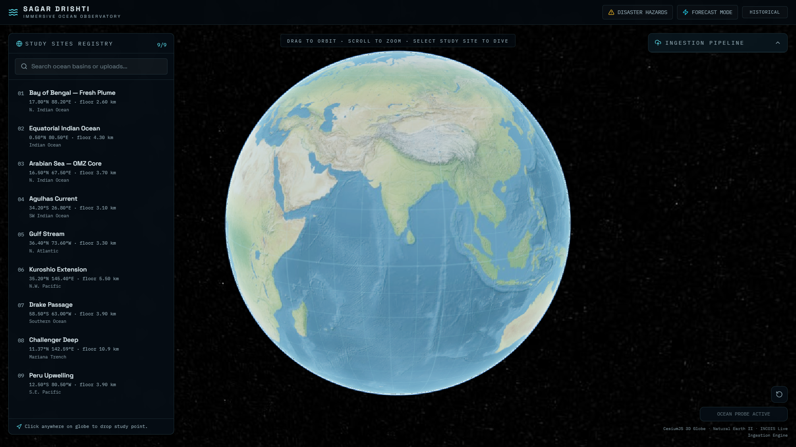
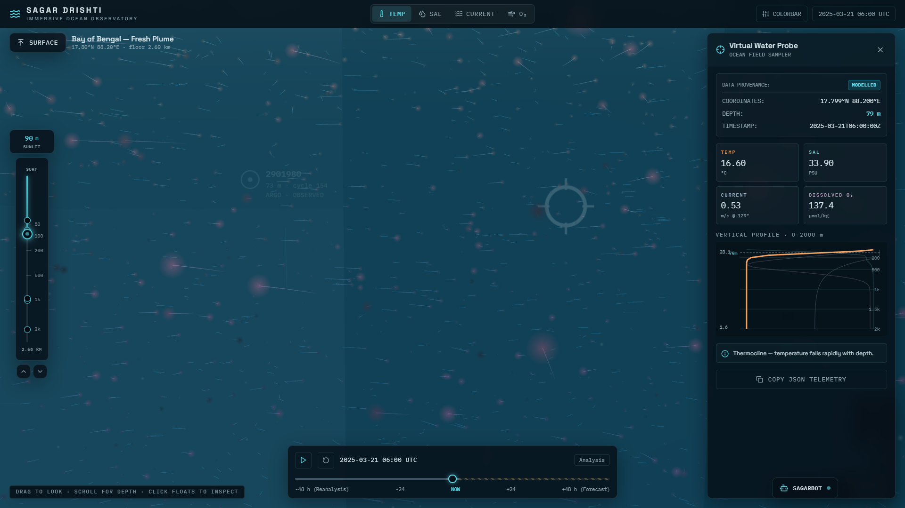
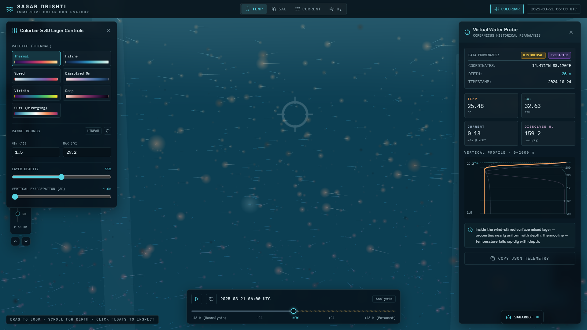
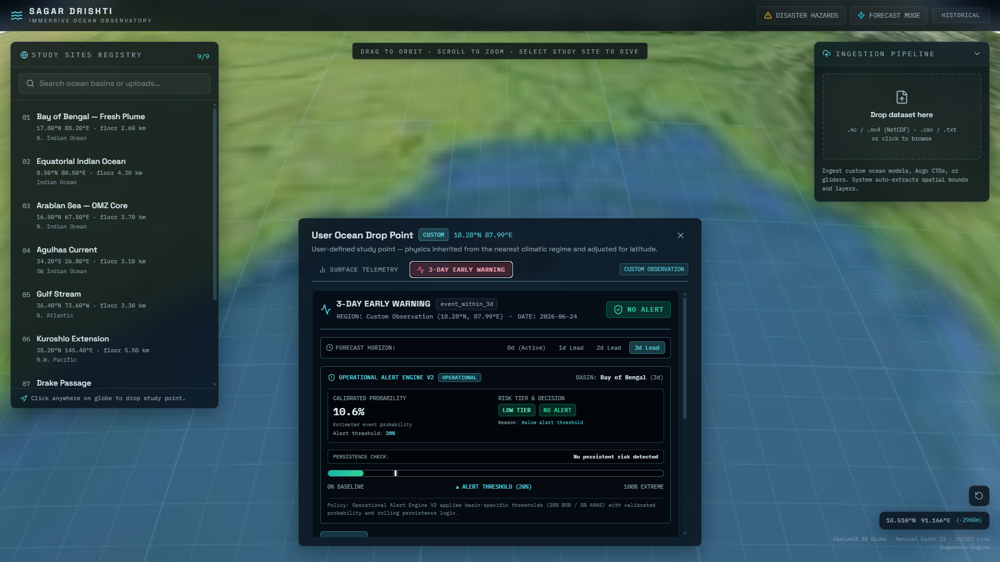
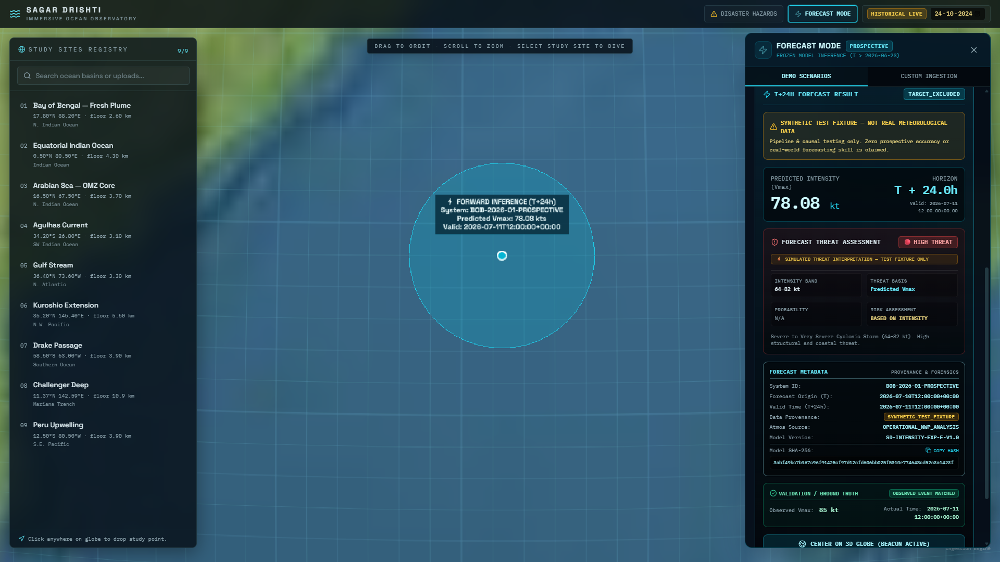
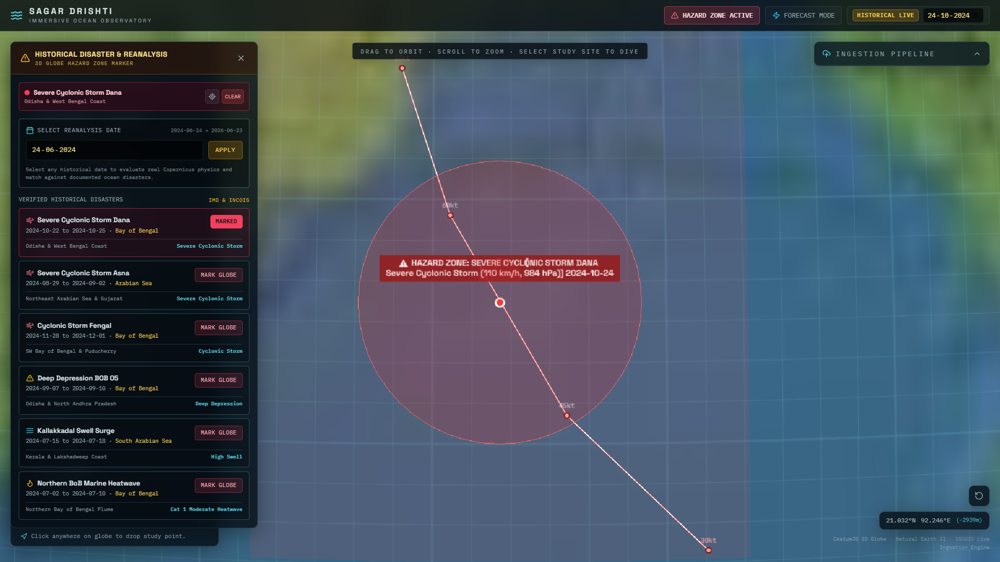

# 🌊 Sagar-Drishti (सागर दृष्टि)
## Immersive Ocean Observatory & High-Performance Decision Intelligence

> **Sagar-Drishti** is an open-source, full-stack planetary-to-abyss 3D oceanographic observatory and decision-support platform. It integrates daily Copernicus Marine physics reanalysis, in-situ Argo profiling arrays, and calibrated machine learning models to enable multi-scale ocean exploration, 3-day operational early warning assessments, and prospective cyclone intensity forecasting workflows across the North Indian Ocean.

[](https://www.python.org/)
[](https://nodejs.org/)
[](https://fastapi.tiangolo.com/)
[](https://react.dev/)
[](https://www.typescriptlang.org/)
[](https://cesium.com/)
[](https://threejs.org/)
[](LICENSE)


*Interactive 3D ocean observatory with global study-site navigation and data ingestion.*

Sagar-Drishti provides a unified interface bridging planetary-scale circulation with localized, depth-resolved water column observations. Researchers and operational analysts can navigate pre-configured study sites across global ocean basins, inspect real-time surface parameters, and ingest custom gridded datasets without specialized desktop GIS software.

---

## 📌 Table of Contents

1. [What Sagar-Drishti Does](#what-sagar-drishti-does)
2. [Explore the Ocean](#explore-the-ocean)
3. [Oceanographic Layer Analysis](#oceanographic-layer-analysis)
4. [Operational Early Warning](#operational-early-warning)
5. [Forecast Mode](#forecast-mode)
6. [Historical Reanalysis & Hazard Mapping](#historical-reanalysis--hazard-mapping)
7. [Core Operational Workflow](#-core-operational-workflow)
8. [Scientific & Machine Learning Architecture](#-scientific--machine-learning-architecture)
9. [Data Sources & Provenance](#-data-sources--provenance)
10. [Scientific Integrity & Audit Safeguards](#-scientific-integrity--audit-safeguards)
11. [System Requirements](#-system-requirements)
12. [Installation & Setup](#-installation--setup)
13. [Configuration](#-configuration)
14. [How to Use (Interactive Walkthrough)](#-how-to-use-interactive-walkthrough)
15. [Forecast & Model Limitations](#-forecast--model-limitations)
16. [Project Directory Structure](#-project-directory-structure)
17. [Troubleshooting](#-troubleshooting)
18. [Automated Testing & Verification](#-automated-testing--verification)
19. [License](#-license)
20. [Credits & Acknowledgments](#-credits--acknowledgments)

---

## What Sagar-Drishti Does

Sagar-Drishti synthesizes heterogeneous physical oceanography data streams and machine learning evaluation pipelines into a streamlined interactive application:

- **Dual-Engine 3D Ocean Space**: Planetary orbital navigation powered by CesiumJS, transitioning into Three.js volumetric particle flow fields from the surface down to the benthic floor ($0\text{--}3,200+\text{ m}$).
- **In-Situ CTD Telemetry**: Extraction and profiling of temperature, salinity, horizontal ocean currents, and dissolved oxygen curves matching active Argo profiling floats.
- **Custom Ocean Data Ingestion**: Drag-and-drop parsing of gridded NetCDF (`.nc`, `.nc4`) and tabular Argo float profiles (`.csv`, `.txt`) with automated coordinate extraction, variable detection, and camera re-centering.
- **Operational Early Warning Analysis**: Calibrated multi-day occurrence probabilities with basin-specific policy thresholds and rolling temporal persistence verification.
- **Prospective Forecast Inference**: Strict causal evaluation workflows for cyclone intensity ($V_{\max}$) with cryptographic model hashing, schema verification, and ground-truth fix matching.
- **Historical Hazard Reanalysis**: Integration of verified cyclone tracks and disaster catalogs with daily Copernicus Marine physics reanalysis states.
- **Context-Grounded Assistance**: Telemetry-aware decision support (SagarBot) grounded in live viewport coordinates, depth, and parameter observations.

---

## Explore the Ocean


*Depth-aware underwater exploration with interactive ocean variables and virtual water-probe telemetry.*

Sagar-Drishti enables seamless transitions from macro planetary orbit directly into the water column, providing an interactive environment to inspect subsurface conditions:

- **Depth Navigation**: An interactive vertical depth slider with sunlit, mesopelagic, and bathypelagic indicators allows users to descend from the sea surface down to benthic depths ($0\text{ to }Z_{\max}$).
- **Interactive Ocean Variables**: Switch across primary physical parameters—Sea Surface Temperature (`TEMP`), Practical Salinity (`SAL`), Current Velocity Magnitude (`CURRENT`), and Dissolved Oxygen ($\text{O}_2$).
- **Virtual Water Probe**: Click anywhere in the volumetric field or select active Argo float beacons to deploy an ocean field sampler displaying live depth, timestamp, and parameter readouts.
- **Vertical Profile Telemetry**: Dynamic CTD profile charts visualize the thermocline and mixed-layer structure from surface to seafloor, with one-click structured JSON telemetry export.
- **Integrated Assistant**: Direct access to SagarBot for instant oceanographic interpretation grounded in the active viewport's physical readings.

---

## Oceanographic Layer Analysis


*Interactive ocean-layer controls with configurable color scales, ranges, opacity, vertical exaggeration, and depth-profile telemetry.*

The platform provides dedicated scientific visualization controls tailored for physical oceanography and hydrographic inspection:

- **Perceptually Uniform Color Palettes**: Configurable scientific color scales based on standard oceanographic palettes, including `Thermal`, `Haline`, `Speed`, `Dissolved O2`, `Viridis`, `Deep`, and diverging `Curl`.
- **Numerical Range Bounds**: User-defined minimum and maximum numerical bounds with linear normalization to isolate specific temperature anomalies or salinity fronts.
- **Layer Opacity & Vertical Exaggeration**: Real-time slider controls for field opacity and vertical exaggeration ($1.0\times$ to $25.0\times$), enhancing subtle vertical stratification and pycnoclines in steep bathymetry.
- **Data Provenance Indicators**: Interface markers clearly distinguishing modeled reanalysis fields from observed in-situ measurements and historical baselines.
- **Full Water-Column Telemetry**: Real-time vertical depth profiles ($0\text{--}2000\text{ m}$) illustrating mixed-layer depth, thermocline steepness, and dissolved oxygen minimum zones.

---

## Operational Early Warning


*Operational alert analysis combining calibrated probability, risk tiers, forecast horizons, and temporal persistence.*

The Operational Alert Engine evaluates upper-ocean thermal and haline pre-conditioning to compute probabilistic disaster risk across defined forecast horizons:

- **Forecast Horizons**: Multi-lead assessment covering active ($0\text{d}$), $1\text{d}$, $2\text{d}$, and $3\text{d}$ prospective lead times.
- **Calibrated Event Probability**: Isotonically calibrated probabilities reflecting whether ocean heat content, sea surface temperature, and salinity stratification exceed climatological baselines.
- **Basin-Specific Policy Thresholds**: Tailored alert thresholds tuned to regional ocean dynamics (e.g., $20.0\%$ for the Bay of Bengal, $8.0\%$ for the Arabian Sea).
- **Risk Tiers & Decision Rules**: Deterministic categorization into `LOW TIER`, `MODERATE TIER`, or `HIGH TIER` risk, generating clear operational statuses (`NO ALERT`, `WATCH`, or `ALERT`).
- **Temporal Persistence Verification**: A rolling multi-day persistence filter that requires signal consistency across consecutive observation cycles, preventing false alarms from transient, single-timestep fluctuations.
- **Physical Context**: Regional ocean drop-point telemetry inherited from nearest climatic regimes with latitude-adjusted physical baselines.

> [!NOTE]
> The Operational Alert Engine evaluates pre-conditioning risk indicators. It is an analytical decision-support prototype and does not replace official meteorological advisories issued by national forecasting agencies.

---

## Forecast Mode


*Prospective forecast workflow with model metadata, threat assessment, provenance, and validation information.*

> [!IMPORTANT]
> **Scientific Integrity Notice**: The scenario displayed in the screenshot above is a **synthetic test fixture** (`SYNTHETIC_TEST_FIXTURE`) with simulated threat interpretation (`SIMULATED THREAT INTERPRETATION — TEST FIXTURE ONLY`). It is used exclusively to demonstrate the forecast interface, causal firewall, and inference workflow. The displayed $78.08\text{ kt}$ value is not an operational prediction of a real meteorological event. Zero prospective forecasting skill or meteorological accuracy is claimed for synthetic fixtures.

Forecast Mode implements a disciplined machine learning inference pipeline designed for rigorous prospective evaluation:

- **Prospective Evaluation Workflow**: Enforces strict chronological evaluation beyond the model training cutoff date ($T > 2026\text{-}06\text{-}23$), eliminating lookahead bias and temporal leakage.
- **Frozen Model Provenance**: The inference pipeline verifies model weights against a cryptographic SHA-256 digest (`3abf49bc...`), guaranteeing complete model immutability during evaluation.
- **Causal Firewall & Schema Contract**: Pre-flight checks validate that every feature in the input vector satisfies observation timestamp constraints ($T_{\text{obs}} \le T_{\text{origin}}$) and conforms to the 29-feature schema contract.
- **Intensity vs. Probability Segregation**: Forecast output predicts continuous maximum sustained 10-meter wind speed ($V_{\max}$ in knots) and classifies the threat category. Risk assessment is designated as `BASED ON INTENSITY` while strictly setting `Probability: N/A` to avoid conflating numerical intensity with event occurrence likelihood.
- **Ground-Truth Verification**: Supports post-event validation by matching model inferences against observed best-track data fixes once official ground-truth observations become available.

---

## Historical Reanalysis & Hazard Mapping


*Historical disaster reanalysis with event tracks, hazard zones, and ocean-state context.*

The Historical Disaster & Reanalysis module bridges retrospective disaster documentation with continuous physical ocean reanalysis:

- **Authoritative Disaster Catalog**: Integrated historical cyclonic events and marine hazards referencing official India Meteorological Department (IMD) and INCOIS records:
  - *Severe Cyclonic Storm Dana* (October 2024 · Odisha & West Bengal Coast)
  - *Severe Cyclonic Storm Asna* (August–September 2024 · Arabian Sea & Gujarat)
  - *Cyclonic Storm Fengal* (November–December 2024 · SW Bay of Bengal & Puducherry)
  - *Deep Depression BOB 05* (September 2024 · Odisha & North Andhra Pradesh)
  - *Kallakkadal Swell Surge Events* (July 2024 · Kerala & Lakshadweep Coast)
  - *Marine Heatwave Events* (July 2024 · Northern Bay of Bengal Plume)
- **3D Globe Hazard Markers**: Projects verified storm tracks, central coordinate nodes with intensity markers (e.g., $30\text{ kt}$, $45\text{ kt}$, $60\text{ kt}$), and dynamic hazard zones directly onto the planetary globe.
- **Temporal Reanalysis Navigation**: Select any historical date to evaluate authentic Copernicus Marine physics grids (`cmems_mod_glo_phy_my_0.083deg_P1D-m`) and examine the oceanic pre-conditions that coincided with documented severe weather events.

---

## 🔄 Core Operational Workflow

Sagar Drishti enforces an 8-stage chronological workflow from raw ocean data to decision support:

```mermaid
flowchart LR
    A["1. Ingest Data<br/>(NetCDF / Argo CSV)"] --> B["2. Planetary Orbit<br/>(CesiumJS 3D)"]
    B --> C["3. Surface Telemetry<br/>(SST, SSS, SSH, MLD)"]
    C --> D["4. Dive Transition<br/>(Orbit to Abyss)"]
    D --> E["5. Water Column Probe<br/>(Argo CTD Profiles)"]
    E --> F["6. 3-Day Early Warning<br/>(Operational Alert V2)"]
    F --> G["7. Forward Forecast<br/>(T+24h Intensity Vmax)"]
    G --> H["8. Ground-Truth Audit<br/>(Validation Checklist)"]
```



1. **Observe**: Planetary orbit visualization of study sites, hazard zones, and floating sensor arrays.
2. **Ingest**: Drag-and-drop ingestion of standard NetCDF (`.nc`, `.nc4`) and tabular Argo float profiles (`.csv`, `.txt`).
3. **Examine**: Real-time extraction of surface physical variables (SST, SSS, ocean velocity, seafloor bathymetry).
4. **Dive**: Seamless descent through the ocean surface layer into volumetric 3D particle flow fields.
5. **Sample**: Float-level CTD probing with vertical profiles ($0\text{ to }Z_{\max}$), thermoclines, and oxygen minimum zones.
6. **Detect**: Operational Alert Engine V2 computing calibrated event probabilities, policy thresholds, and rolling persistence checks.
7. **Forecast**: Prospective intensity predictions ($V_{\max}$) under frozen-model constraints ($T > 2026\text{-}06\text{-}23$).
8. **Validate**: Immediate comparison against historical disaster analogs and ground-truth fix verification.

---

## 🔬 Scientific & Machine Learning Architecture

```
┌──────────────────────────────────────────────────────────────────────────────────┐
│                             DATA INGESTION LAYER                                 │
│  Copernicus Reanalysis (.nc)  │  Argo GDAC Profiles (.csv)  │  Custom Uploads    │
└────────────────────────────────────────┬─────────────────────────────────────────┘
                                         │
                                         ▼
┌──────────────────────────────────────────────────────────────────────────────────┐
│                   FEATURE EXTRACTION & CAUSAL FIREWALL                           │
│  - 101 Canonical Ocean Features (Rolling 7d, 14d, 30d means, standard deviations)│
│  - Atmospheric Coupling: VWS, Vorticity (200-800 km), RH700, Translation Speed   │
│  - Causal Verification: Feature observation timestamp <= Forecast origin (T)     │
└────────────────────────────────────────┬─────────────────────────────────────────┘
                                         │
                                         ▼
┌──────────────────────────────────────────────────────────────────────────────────┐
│                 LEAK-FREE CHRONOLOGICAL SPLIT & EVALUATION                       │
│  - Strict chronological cutoffs (Train: 2024-06 to 2024-10 | Test: 2024-11+)     │
│  - Zero shuffle leakage · Zero future-window lookahead                           │
└───────────────────┬──────────────────────────────────────────┬───────────────────┘
                    │                                          │
                    ▼                                          ▼
┌───────────────────────────────────────┐  ┌───────────────────────────────────────┐
│       OPERATIONAL ALERT ENGINE V2     │  │       PROSPECTIVE INTENSITY ENGINE    │
│  - Horizon-specific Random Forests    │  │  - Frozen Gradient Boosting Model     │
│  - Calibrated Isotonic Probabilities  │  │  - Cryptographic SHA-256 Verification │
│  - Basin Thresholds: 20% BOB / 8% ARAS│  │  - T+24h Predicted Vmax (kt)          │
│  - Multi-Day Persistence Verification │  │  - Intensity-Based Threat Levels      │
└───────────────────┬───────────────────┘  └───────────────────┬───────────────────┘
                    │                                          │
                    ▼                                          ▼
┌──────────────────────────────────────────────────────────────────────────────────┐
│                         DECISION SUPPORT & PRESENTATION                          │
│  - Human-readable status & reasons    │  - Ground-truth validation fixes         │
│  - Non-causal association wording     │  - SagarBot telemetry grounding          │
│  - 3D CesiumJS Planetary Orbit        │  - 3D Three.js Volumetric Particle Flow  │
└──────────────────────────────────────────────────────────────────────────────────┘
```

---

## 📊 Data Sources & Provenance

| Data Source | Provider | Variables Extracted | Temporal Resolution | Spatial Coverage | Role in System |
| :--- | :--- | :--- | :--- | :--- | :--- |
| **Global Ocean Physics Reanalysis** (`cmems_mod_glo_phy_my_0.083deg_P1D-m`) | Copernicus Marine Service (EU) | `thetao` (Temp), `so` (Salinity), `uo`/`vo` (Currents), `zos` (SSH), `mlotst` (MLD) | Daily ($2024\text{-}06\text{-}24$ to $2026\text{-}06\text{-}23$) | $0^\circ\text{--}25^\circ\text{N}$, $50^\circ\text{--}100^\circ\text{E}$ (North Indian Ocean) | Authentic physical ocean baseline & training dataset |
| **In-Situ Argo Profiles** | Argo GDAC / INCOIS | Temperature, Salinity, Pressure, Dissolved $\text{O}_2$, Drift Vectors | Per-cycle (~10 days) | Active floats in Bay of Bengal & Arabian Sea | In-situ ground truth, vertical CTD profiling |
| **Historical Cyclone Tracks** | India Meteorological Department (IMD) & NDMA | Storm coordinates, track timestamps, central pressure, maximum sustained wind | 6-hourly best tracks | North Indian Ocean basin ($1970\text{--}2024$) | Historical disaster analogs, parameter matching, hazard zones |
| **Synthetic Testbeds** | Sagar Drishti Pipeline | 29 atmospheric/oceanic feature vectors | Discrete test origin timestamps | Bay of Bengal & Arabian Sea test coordinates | Pipeline integrity testing & causal constraint verification |

---

## 🛡️ Scientific Integrity & Audit Safeguards

Sagar Drishti is built upon strict scientific safeguards to ensure reproducibility and prevent artificial inflation of predictive performance:

1. **Strict Chronological Train/Test Split**:
   - Training datasets are restricted to chronologically antecedent observations ($2024\text{-}06\text{-}24$ through $2024\text{-}10\text{-}31$).
   - Testing is performed strictly on subsequent periods, ensuring zero data contamination across splits.
2. **Causal Firewall**:
   - The pre-flight causal checklist verifies that every feature in the input vector has an observation timestamp strictly less than or equal to the evaluation origin ($T$).
   - Data released or published after $T$ is rejected.
3. **Frozen Model Integrity**:
   - Research models are cryptographically hashed using SHA-256 (`3abf49bc...`).
   - Every inference run verifies model integrity before executing predictions.
4. **Non-Causal Associative Framing**:
   - Feature importances are explicitly reported as statistical correlations associated with elevated model scores.
   - The UI and SagarBot strictly forbid claiming that ocean parameters "caused" a cyclonic storm.
5. **Calibrated Probability vs. Numerical Intensity**:
   - Operational Alert Engine V2 outputs **calibrated event probabilities** over a defined forecast window.
   - Forward Forecast Mode outputs **predicted numerical intensity ($V_{\max}$)** with `Probability: N/A`.
   - The two concepts are strictly kept segregated to prevent misinterpretation.
6. **Synthetic Fixture Disclaimer**:
   - Demonstration test fixtures are prominently marked: `SYNTHETIC TEST FIXTURE — NOT REAL METEOROLOGICAL DATA`.
   - Zero prospective accuracy or real-world forecasting skill is claimed for synthetic test fixtures.
7. **Single-Event Test Split Transparency**:
   - The system openly discloses that independent held-out evaluation was conducted on the Cyclone Fengal event (Nov 2024) and does not establish broad multi-basin generalization. Official forecasts must always be obtained from the India Meteorological Department (IMD).

---

## 💻 System Requirements

### Hardware Requirements
- **Processor**: Modern quad-core CPU (Intel i5/i7/i9, AMD Ryzen 5/7/9, or Apple Silicon M1/M2/M3).
- **RAM**: Minimum 8 GB (16 GB recommended for multi-gigabyte NetCDF slicing).
- **Graphics**: Dedicated or integrated GPU with WebGL2 support.
- **Storage**: Minimum 2 GB free disk space (additional storage required if downloading full historical Copernicus archives).

### Software Requirements
- **Node.js**: `v18.0.0` or higher (LTS recommended).
- **Python**: `3.10`, `3.11`, `3.12`, `3.13`, or `3.14`.
- **Operating System**: Windows 10/11, macOS 12+, or Ubuntu 20.04+ / Linux.
- **Web Browser**: Modern browser with WebGL2 enabled (Google Chrome, Microsoft Edge, Mozilla Firefox, Brave, Safari 15+).

---

## 🚀 Installation & Setup

### Step 1: Clone the Repository
```bash
git clone https://github.com/SamarVishwakarma2006/Sagar-Drishti.git
cd Sagar-Drishti
```

---

### Step 2: Set Up Backend (FastAPI)

#### Windows (PowerShell / Command Prompt):
```powershell
# Navigate to backend directory
cd backend

# Create and activate a Python virtual environment (recommended)
python -m venv venv
.\venv\Scripts\activate

# Install required Python packages
pip install -r requirements.txt

# Generate synthetic sample datasets (sample_argo_profiles.csv and sample_ocean_grid.nc)
python sample_data/generate_samples.py

# Run the automated backend test suite
python -m unittest discover -s tests -t .

# Start the FastAPI server (runs on http://localhost:8000)
python run_backend.py
```

#### macOS / Linux (Bash / Zsh):
```bash
# Navigate to backend directory
cd backend

# Create and activate a Python virtual environment
python3 -m venv venv
source venv/bin/activate

# Install required Python packages
pip install -r requirements.txt

# Generate synthetic sample datasets
python sample_data/generate_samples.py

# Run the automated backend test suite
python -m unittest discover -s tests -t .

# Start the FastAPI server (runs on http://localhost:8000)
python run_backend.py
```

> **Backend Verification**: Open [http://localhost:8000/docs](http://localhost:8000/docs) in your browser. You should see the interactive Swagger API documentation.

---

### Step 3: Set Up Frontend (React + Vite)

Open a **new terminal window**:

#### Windows (PowerShell / Command Prompt):
```powershell
# Navigate to frontend directory
cd frontend

# Install Node dependencies
npm.cmd install

# Start the Vite development server (runs on http://localhost:3000)
npm.cmd run dev
```

*(Note: On Windows systems where PowerShell script execution policy restricts `npm.ps1`, use `cmd.exe /c "npm run dev"` or `npx vite`)*

#### macOS / Linux (Bash / Zsh):
```bash
# Navigate to frontend directory
cd frontend

# Install Node dependencies
npm install

# Start the Vite development server
npm run dev
```

> **Application Launch**: Open your web browser and navigate to **[http://localhost:3000](http://localhost:3000)**.

---

## ⚙️ Configuration

Create a `.env` file in the `backend/` directory if you wish to configure optional LLM providers or Copernicus credentials:

```ini
# backend/.env (Optional)

# Application Settings
HOST=0.0.0.0
PORT=8000

# Copernicus Marine Service Credentials (Optional - for downloading fresh 2-year reanalysis)
COPERNICUSMARINE_SERVICE_USERNAME="your_copernicus_username"
COPERNICUSMARINE_SERVICE_PASSWORD="your_copernicus_password"
COPERNICUS_DATA_DIR="data/copernicus"

```

---

## 📖 How to Use (Interactive Walkthrough)

### 1. Explore the Planetary Globe
- Use the left mouse button to click and drag to rotate the globe.
- Use the scroll wheel to zoom in and out.
- The bottom-right coordinate readout displays your real-time geographic mouse coordinates (`lat`, `lon`).
- Click the **Recenter** icon in the bottom-right corner to return the camera to the default Indian Ocean overview.

### 2. Select an Ocean Study Site
- In the top-left **Study Sites** drawer, select any site (e.g., *Bay of Bengal Central Deep Basin*).
- The camera automatically flies to the site coordinates and highlights the boundary.
- The floating **Site Panel** appears at the bottom with live surface telemetry: SST, SSS, surface velocity, and seafloor depth.

### 3. Evaluate 3-Day Early Warning
- In the floating Site Panel, click the **3-DAY EARLY WARNING** tab.
- Inspect the **Calibrated Probability** metric (e.g., `10.6% Estimated event probability`).
- Compare against the basin-specific **Alert Threshold** (`20%` for Bay of Bengal, `8%` for Arabian Sea).
- Verify the **Persistence Check** status (`No persistent risk detected` or `Multi-day persistence confirmed`).
- Review the **Top Associated Physical Indicators** and toggle the **Variable & Temporal Scale Breakdown** to view multi-window heat distribution.

### 4. Open Prospective Forecast Mode
- In the top navigation bar, click the **FORECAST MODE** button.
- Choose between:
  - **Demo Scenarios**: Select post-historical test fixtures (e.g., *Deep Depression BOB-2026-07*).
  - **Custom Ingestion**: Supply an observation ID, observation timestamp, and JSON feature vector.
- Review the **Forecast Validation Check** to verify that all 29 features meet the causal contract.
- Click **GENERATE FORECAST**.
- Inspect the predicted maximum wind speed (**$V_{\max}$** in knots) and the **Forecast Threat Assessment**.
- Click **CENTER ON 3D GLOBE** to view the forecast origin beacon on the planetary map.

### 5. Inspect Historical Disasters
- In the top bar, click **DISASTER HAZARDS**.
- Browse authoritative historical events (e.g., *Cyclone Dana*, *Cyclone Asna*, *Cyclone Fengal*).
- Click **MARK HAZARD ZONE ON 3D GLOBE** to project the storm's best-track path and spatial boundary onto the CesiumJS globe.
- View multi-parameter comparison matrices comparing current observations against historical storm states.

### 6. Dive into the Volumetric Ocean
- In the bottom Site Panel, click the **DIVE** button.
- The planetary camera dives through the surface layer, accompanied by a transition veil.
- You are now in the Three.js Volumetric Engine:
  - Drag the mouse to look around in 3D.
  - Scroll or use the left **Depth Control** slider to descend from the surface ($0\text{ m}$) to the seafloor ($3,200\text{ m}$).
  - Yellow float parking pips indicate real Argo float depths.
  - In the top bar, switch between physical variable layers (**Temperature**, **Salinity**, **Currents**, **Oxygen**).
  - Click **COLORBAR** in the top right to customize palettes, adjust min/max limits, or increase vertical depth exaggeration ($1\times$ to $25\times$).

### 7. Probe Floats with Virtual Water Probe
- Click on any yellow float beacon in the 3D underwater scene (or click the water probe icon).
- The **Inspector** panel opens on the right.
- Inspect real in-situ physical readings (Temperature, Salinity, Velocity, Dissolved $\text{O}_2$).
- Review the interactive **Vertical Profile Chart** ($0\text{ to }Z_{\max}$) showing full water column stratification.
- Click **COPY JSON TELEMETRY** to export the probe reading as structured JSON.
- Click **SURFACE** in the top-left to return to orbit.

### 8. Consult SagarBot
- Click the **SAGARBOT** icon in the bottom right corner.
- SagarBot opens, pre-grounded in your active viewport telemetry (active site, current depth, observed value, time offset, nearby Argo float IDs).
- Click any suggested prompt chips (e.g., *"Cyclone Risk in BOB?"*, *"Why Risk Elevated?"*, *"Explain Thermocline"*) or type your own question.
- SagarBot delivers structured scientific decision support with explicit evidence citations, non-causal language, and stated limitations.

---

## ⚠️ Forecast & Model Limitations

In accordance with scientific integrity standards, Sagar Drishti maintains explicit boundaries:

1. **Research & Decision Support Only**:
   - Sagar Drishti is a research observatory and decision-support prototype. Official operational cyclone forecasts and disaster warnings are issued exclusively by the **India Meteorological Department (IMD)**.
2. **Probability vs. Intensity Segregation**:
   - The calibrated probability produced by Operational Alert Engine V2 is an **event occurrence probability** over a multi-day forecast window.
   - It is **not** the probability of reaching a specific numerical wind speed ($V_{\max}$).
   - The prospective intensity engine predicts continuous wind speed ($V_{\max}$ in knots) and does not compute occurrence probabilities (`Probability: N/A`).
3. **Synthetic Testbed Disclaimer**:
   - Synthetic demo fixtures are designed for algorithmic pipeline and causal constraint verification.
   - Zero prospective forecasting skill or meteorological accuracy is claimed for synthetic test fixtures.
4. **Single-Event Held-Out Test Set**:
   - The independent test set evaluation of the V2 alert engine is based on the single real-world cyclonic disturbance in the reanalysis window (Cyclone Fengal, November 2024).
   - Statistical performance cannot be assumed to generalize universally across all cyclone intensity categories or basins without multi-year longitudinal validation.
5. **Atmospheric Forcing Dependencies**:
   - The ocean alert engine operates primarily on upper-ocean physical indicators. Tropical cyclogenesis also depends on atmospheric parameters (barometric pressure, middle-troposphere moisture, vertical wind shear) which are integrated in Forward Forecast Mode but remain external to pure oceanographic field samplers.

---

## 📁 Project Directory Structure

```
Sagar-Drishti/
├── docs/                                # Architectural documentation & screenshot assets
│   ├── forward_prediction.md            # Forward forecasting methodology & forensic report
│   └── screenshots/                     # Documentation screenshot assets
│       ├── 01-global-ocean-observatory.png
│       ├── 02-underwater-water-probe.png
│       ├── 03-operational-alert-engine.png
│       ├── 04-forecast-mode.png
│       ├── 05-historical-reanalysis.png
│       └── 06-ocean-layer-controls.png
├── backend/                             # High-Performance FastAPI Backend
│   ├── app/
│   │   ├── api/
│   │   │   └── endpoints.py             # REST API endpoints (/upload, /sites, /prediction, /chat)
│   │   ├── parsers/
│   │   │   ├── netcdf_parser.py         # xarray & netCDF4 coordinate/variable extraction
│   │   │   └── tabular_parser.py        # Argo & CTD CSV header detection and GeoJSON parser
│   │   ├── services/
│   │   │   ├── prediction_service.py    # Operational Alert Engine V2 & ML inference
│   │   │   ├── prospective_cyclone_engine.py # Frozen prospective forward forecasting engine
│   │   │   ├── sagarbot_service.py      # Context-grounded decision intelligence & guardrails
│   │   │   ├── event_store.py           # Historical disaster event catalog & parameter matching
│   │   │   ├── slice_engine.py          # 2D horizontal & vertical depth array slicing
│   │   │   └── site_registry.py         # Baseline study sites & custom upload registry
│   │   ├── models/
│   │   │   └── schemas.py               # Pydantic V2 strictly typed request/response models
│   │   └── main.py                      # FastAPI app entry point & CORS configuration
│   ├── data/
│   │   └── copernicus/                  # Copernicus Marine physical reanalysis storage
│   ├── models/                          # Serialized trained scikit-learn & joblib models
│   │   ├── risk_model_0d.joblib         # 0-Day lead operational model
│   │   ├── risk_model_1d.joblib         # 1-Day lead operational model
│   │   ├── risk_model_2d.joblib         # 2-Day lead operational model
│   │   ├── risk_model_3d.joblib         # 3-Day lead operational model
│   │   └── model_metadata.json          # Model hyperparameters, feature lists & thresholds
│   ├── sample_data/                     # Synthetic test generation scripts & datasets
│   │   ├── generate_samples.py          # Generates test .nc and .csv files
│   │   ├── sample_argo_profiles.csv     # In-situ Argo profile test dataset
│   │   └── sample_ocean_grid.nc         # 4D synthetic NetCDF ocean model grid
│   ├── scripts/                         # Offline utilities (ingest_copernicus.py, train models)
│   ├── tests/                           # Comprehensive automated test suite
│   │   ├── test_backend.py              # Core API endpoints & parsers
│   │   ├── test_forward_prediction.py   # Forward forecasting & causal validation
│   │   ├── test_cyclone_intensity_prospective.py # Prospective intensity checks & audits
│   │   └── test_sagarbot_intelligence.py # SagarBot intents & guardrail tests
│   ├── requirements.txt                 # Backend Python package dependencies
│   └── run_backend.py                   # One-click backend startup script
│
├── frontend/                            # Modular React + Vite + TypeScript Frontend
│   ├── src/
│   │   ├── components/
│   │   │   ├── TopBar.tsx               # Header with variable switchers, Forecast & Disaster buttons
│   │   │   ├── SiteExplorer.tsx         # Study sites drawer (auto-flies to bounds)
│   │   │   ├── SitePanel.tsx            # Floating site telemetry & 3-Day Early Warning tab
│   │   │   ├── EarlyWarningCard.tsx     # Operational Alert Engine V2 & risk explainability
│   │   │   ├── ForwardPredictionPanel.tsx # Prospective Forecast Mode & causal checklist
│   │   │   ├── HistoricalDisasterSelector.tsx # Historical event catalog & 3D hazard zones
│   │   │   ├── DataIngestionPanel.tsx   # Drag-and-drop dropzone for NetCDF and Argo CSV
│   │   │   ├── Inspector.tsx            # Virtual water probe & vertical depth profile charts
│   │   │   ├── ColorbarControls.tsx     # Palette switcher, bounds clamping & 3D exaggeration
│   │   │   ├── SagarBot.tsx             # Grounded AI co-pilot chat drawer
│   │   │   ├── DepthControl.tsx         # Vertical depth slider with float parking pips
│   │   │   ├── Timeline.tsx             # Temporal playback scrubber (-48h to +48h)
│   │   │   ├── CompassHud.tsx           # 3D yaw compass heading & view reset
│   │   │   ├── CoordReadout.tsx         # Geographic mouse coordinate tracking
│   │   │   ├── Veil.tsx                 # Dive / ascend transition overlay
│   │   │   ├── GlobeViewer.tsx          # CesiumJS 3D Globe integration
│   │   │   └── UnderwaterViewer.tsx     # Three.js volumetric particle flow integration
│   │   ├── engines/
│   │   │   ├── GlobeEngine.ts           # CesiumJS entities, camera flights & disaster hazard zones
│   │   │   └── UnderwaterEngine.ts      # Three.js fluid velocity particles, snow & seafloor
│   │   ├── services/
│   │   │   ├── api.ts                   # REST API client with robust offline fallbacks
│   │   │   └── syntheticOcean.ts        # Synthetic physics engine & cmocean colormaps
│   │   ├── store/
│   │   │   └── oceanStore.ts            # Central reactive store & external subscriptions
│   │   ├── types/
│   │   │   └── ocean.ts                 # TypeScript type definitions
│   │   ├── App.tsx                      # Root application layout coordinator
│   │   ├── main.tsx                     # React DOM entry point
│   │   └── index.css                    # Design tokens & glassmorphic styles
│   ├── package.json                     # Frontend package manifest
│   ├── tsconfig.json                    # TypeScript compiler configuration
│   └── vite.config.ts                   # Vite bundler configuration & Cesium plugin
│
├── research/                            # Research artifacts & evaluation logs
│   └── cyclone_intensity/              # Prospective evaluation manifests & audit logs
│       ├── prospective/                 # Frozen prospective logs & evaluation reports
│       └── training_design.md           # Formal ML methodology & architecture document
│
└── README.md                            # Comprehensive project documentation
```

---

## 🔧 Troubleshooting

### 1. PowerShell Script Execution Restriction (Windows)
**Issue**: Running `npm run dev` in PowerShell displays `File ... npm.ps1 cannot be loaded because running scripts is disabled`.  
**Resolution**: Run using Command Prompt (`cmd.exe /c "npm run dev"`) or launch Vite directly using `npx vite`.

### 2. Port Already in Use
**Issue**: Backend reports `Address already in use: 8000` or frontend reports `Port 3000 is in use`.  
**Resolution**:
- If port 8000 is occupied, start backend on another port: `python -m uvicorn app.main:app --port 8001`. Update the proxy port in `frontend/vite.config.ts`.
- If port 3000 is occupied, Vite will automatically prompt to use the next available port (e.g., `3001`).

### 3. Missing Sample Datasets
**Issue**: Backend warns that `sample_argo_profiles.csv` or `sample_ocean_grid.nc` is not found.  
**Resolution**: Run the sample generator script from the backend directory:
```powershell
python sample_data/generate_samples.py
```

### 4. CesiumJS Token Warning
**Issue**: Console displays notice regarding Cesium Ion token.  
**Resolution**: Sagar Drishti uses offline-capable Natural Earth II planetary tiles via CesiumJS, which operates without an Ion token. The application functions fully out-of-the-box.

---

## 🧪 Automated Testing & Verification

Sagar Drishti includes an automated test suite spanning unit tests, API integration tests, prospective evaluation audits, and guardrail validations:

```powershell
# 1. Run Core Backend Unit & Integration Tests (112 tests)
cd backend
python -m unittest discover -s tests -t .

# 2. Run Forward Prediction & Prospective Evaluation Tests (76 tests)
python -m pytest tests/test_forward_prediction.py tests/test_cyclone_intensity_prospective.py

# 3. Verify Frontend TypeScript Compilation & Production Bundle
cd ../frontend
npm run build
```

---

## ⚖️ License

This project is licensed under the **MIT License** — see the [LICENSE](LICENSE) file for details.

```
MIT License

Copyright (c) 2024-2026 Sagar Drishti Contributors

Permission is hereby granted, free of charge, to any person obtaining a copy
of this software and associated documentation files (the "Software"), to deal
in the Software without restriction, including without limitation the rights
to use, copy, modify, merge, publish, distribute, sublicense, and/or sell
copies of the Software, and to permit persons to whom the Software is
furnished to do so, subject to the following conditions:

The above copyright notice and this permission notice shall be included in all
copies or substantial portions of the Software.
```

---

## 🤝 Credits & Acknowledgments

- **Copernicus Marine Service (E.U. Copernicus Programme)**: Global Ocean Physics Reanalysis dataset (`cmems_mod_glo_phy_my_0.083deg_P1D-m`).
- **INCOIS (Indian National Centre for Ocean Information Services)**: Marine observation guidelines and Indian Ocean physical domain baselines.
- **Argo Global Data Assembly Centre (GDAC)**: International Argo float data collection, CTD profiling standards, and open marine data stewardship.
- **India Meteorological Department (IMD)** & **NDMA**: Authoritative North Indian Ocean cyclone best-track archives, storm classifications, and historical damage documentation.
- **CesiumJS & Three.js Communities**: Open-source 3D geospatial rendering engines and WebGL shader primitives.
- **cmocean**: Beautiful, perceptually uniform colormaps designed specifically for oceanography (Thyng et al., 2016).
