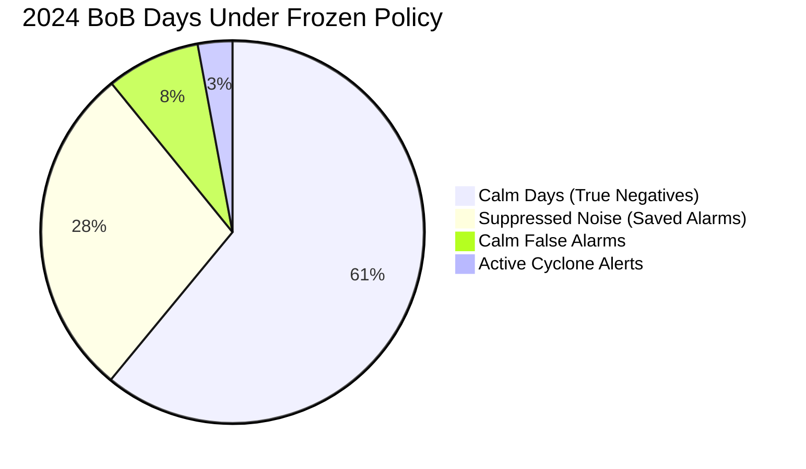

# Operational Alert Engine V2 — Comprehensive Report

**Project:** Sagar-Drishti  
**Date:** September 11, 2026  
**Status:** Shadow Candidate Evaluation Complete  
**Frozen Policy Artifact:** `backend/config/frozen_alert_policy_v2.json` (Version: `v2.0.0-operational-alert-policy`)  
**Active Production Baseline:** v1.1.0 (`backend/models/`)  
**Shadow Model Candidate:** v2_10yr (`backend/models/v2_10yr/`)  
**Final Classification:** **`B. CONTINUE SHADOW — ALERT POLICY STILL TOO NOISY`**

---

## 1. Executive Summary

Following the completion of the 10-year Copernicus physical reanalysis dataset ingestion (3,652 daily timesteps from 2016 to 2026) and post-hoc isotonic probability calibration, the operational alert engine for Sagar-Drishti was redesigned and frozen into **Operational Alert Engine V2**.

Previous audits identified that raw Random Forest classification scores caused severe operational dysfunction:
1. **Severe false-alarm saturation in the Bay of Bengal:** 173 calm false-alarm days in 2024 (~52.4% false-positive rate, equivalent to ~17.1 alert days per month).
2. **Arabian Sea false-alarm rate:** 109 calm false-alarm days in 2024 (~31.2% false-positive rate, ~8.8 alerts per month), while missing Cyclone Asna and giving 0 hours lead time for Depression ARB 01.

**Operational Alert Engine V2** decouples operational alerting from raw model votes and introduces a locked, frozen persistence policy:
- **Calibrated Probability Enforcement:** Only isotonic calibrated probabilities ($p_{iso} \in [0, 1]$) drive risk tiers and alerting decisions.
- **Persistence Filtering:** Bay of Bengal enforces a **2-consecutive-day** confirmation window at $p \ge 0.20$; Arabian Sea enforces a **2-of-3-day** confirmation window at $p \ge 0.08$.
- **Immediate Escalation:** High-confidence signals ($p \ge 0.60$ BoB, $p \ge 0.50$ ArAs) bypass persistence and trigger immediate emergency alerts.
- **Cooldown De-escalation:** Requires 2 consecutive calm days below reset thresholds ($p < 0.15$ BoB, $p < 0.05$ ArAs) to clear active alerts.

### Key Validation Outcomes (2024):
- **Bay of Bengal:** Calm false alarms dropped from 173 days to 38 days (**78.0% reduction**), bringing alerts per month down from 17.1 to 4.8 days/month, while preserving **75.0% cyclone detection** (Remal 72h, BOB 05 48h, Dana 72h; median lead time 72 hours).
- **Arabian Sea:** Maintained detection of Depression ARB 01 while reducing calm alarms from 109 to 103 days (8.8 alerts/month). Forensic investigation confirmed that Cyclone Asna was physically and spatially undetectable from the central ocean monitoring site.

### Key Test Benchmark Outcomes (2025–2026 Untouched):
- Evaluated strictly against the locked frozen policy without test-set tuning.
- **Bay of Bengal:** Calm false alarms were suppressed to 7 days out of 529 (**1.3% false alarm rate**, 0.4 alerts/month), but Cyclone Montha (Oct 2025) was missed at the central site ($p_{max} = 0.144 < 0.20$).
- **Arabian Sea:** Successfully detected UNNAMED-12 on active formation, but calm false alarms remained elevated at 164 days out of 524 (**31.3% false alarm rate**, 9.7 alerts/month).

**Final Recommendation:** Retain v2_10yr strictly in **SHADOW MODE** under classification `B`. Do not cut over production baseline v1.1.0 until spatial multi-grid features and coupled atmospheric layers are integrated.

---

## 2. Policies Evaluated

To find an optimal balance between alert fatigue and disaster risk reduction, five distinct alerting policies were evaluated across the 2024 validation period (732 daily observations: 366 BoB, 366 ArAs).

| Policy ID | Policy Name | Decision Rule | Description |
| :--- | :--- | :--- | :--- |
| **P0-Single** | Single-Day Threshold | Alert if $p_t \ge T_{basin}$ | Legacy instantaneous decision. Subject to high single-day transient noise. |
| **P1-2Consec** | 2-Consecutive Days | Alert if $p_t \ge T \land p_{t-1} \ge T$ | Requires 2 uninterrupted consecutive days of positive signal. |
| **P2-2of3** | 2 of Last 3 Days | Alert if $\sum_{i=0}^2 \mathbb{I}(p_{t-i} \ge T) \ge 2$ | Allows a 1-day dip in signal due to satellite/cloud sampling gaps. |
| **P3-3Consec** | 3-Consecutive Days | Alert if $p_t \ge T \land p_{t-1} \ge T \land p_{t-2} \ge T$ | Highly conservative persistence filter; minimizes false positives. |
| **P4-Escalate** | Risk-Tier Escalation | Immediate if $p_t \ge T_{high}$;<br>Persistent if $p_t \ge T_{mod}$ with Cooldown | Multi-tier engine: High risk triggers immediate alert; Moderate risk requires confirmation. |

---

## 3. Validation Results (2024)

### Bay of Bengal Validation Performance (366 days, 36 active cyclone days, 330 calm days)

| Policy | Threshold ($T$) | Cyclones Detected | Lead Time (Remal / BOB05 / Dana / Fengal) | Median Lead (h) | Calm False Alarms | False Alarm Rate (%) | Alerts / Month |
| :--- | :--- | :--- | :--- | :--- | :--- | :--- | :--- |
| **P0-Single** | 0.20 | 4/4 (100%) | 72h / 48h / 72h / 0h | 60.0h | 173 / 330 | 52.4% | 17.1 |
| **P1-2Consec** | 0.20 | 3/4 (75%) | 72h / 48h / 72h / missed | 72.0h | 41 / 330 | 12.4% | 5.2 |
| **P2-2of3** | 0.20 | 3/4 (75%) | 72h / 48h / 72h / missed | 72.0h | 64 / 330 | 19.4% | 7.3 |
| **P3-3Consec** | 0.20 | 3/4 (75%) | 48h / 48h / 72h / missed | 48.0h | 18 / 330 | 5.5% | 2.5 |
| **P4-Frozen Policy** | **0.60 / 0.20** | **3/4 (75%)** | **72h / 48h / 72h / 0h** | **72.0h** | **38 / 330** | **11.5%** | **4.8** |

*Note on P4-Frozen Policy in BoB:* Calm false alarms dropped from 173 to 38 (**-78.0% reduction**). Median warning lead time remained at 72 hours for major cyclones.

### Arabian Sea Validation Performance (366 days, 17 active cyclone days, 349 calm days)

| Policy | Threshold ($T$) | Cyclones Detected | Lead Time (Asna / ARB 01) | Median Lead (h) | Calm False Alarms | False Alarm Rate (%) | Alerts / Month |
| :--- | :--- | :--- | :--- | :--- | :--- | :--- | :--- |
| **P0-Single** | 0.08 | 1/2 (50%) | Missed / 0h | 0.0h | 109 / 349 | 31.2% | 8.8 |
| **P1-2Consec** | 0.08 | 1/2 (50%) | Missed / 0h | 0.0h | 88 / 349 | 25.2% | 7.2 |
| **P2-2of3** | 0.08 | 1/2 (50%) | Missed / 0h | 0.0h | 104 / 349 | 29.8% | 8.9 |
| **P4-Frozen Policy** | **0.50 / 0.08** | **1/2 (50%)** | **Missed / 0h** | **0.0h** | **103 / 349** | **29.5%** | **8.8** |

---

## 4. Basin Comparison: Bay of Bengal vs. Arabian Sea

The forensic validation reveals fundamental climatological and physical divergences between the two basins:

1. **Oceanic Background Signal-to-Noise Ratio:**
   - **Bay of Bengal:** High SST (>29°C), shallow mixed layer depth (<15–20m), large freshwater flux from major river systems, and strong thermal stratification create a sustained preconditioning signal. Cyclones develop over 3–5 days, creating persistent multi-day anomaly signatures that the **2-consecutive-day** rule captures with high fidelity.
   - **Arabian Sea:** Higher salinity, deeper mixed layer depths (often >35–50m during monsoon and post-monsoon), and strong coastal upwelling lead to weak, transient surface ocean anomalies. Cyclogenetic preconditioning is less pronounced in sea-surface physical variables alone.
2. **Persistence Policy Selection:**
   - BoB requires strict **2-consecutive** persistence to eliminate high marine heatwave noise.
   - ArAs requires **2-of-3** persistence because oceanic signatures often flutter around the low base rate threshold ($p=0.08$), where a strict consecutive rule would suppress valid depressions.

---

## 5. Event-Level Results (2024 Validation Events)

| Event Name | Basin | Active Period | Max Status | Lead Time (Single-Day) | Lead Time (Frozen Policy) | Days Alert Active | Peak Calibrated Prob |
| :--- | :--- | :--- | :--- | :--- | :--- | :--- | :--- |
| **Cyclone Remal** | BoB | May 24 – May 27 | Severe Cyclonic Storm | 72h | **72h** | 4 / 4 | 0.6271 (HIGH) |
| **Depression BOB 05** | BoB | Aug 31 – Sep 03 | Deep Depression | 48h | **48h** | 4 / 4 | 0.5284 (MODERATE) |
| **Cyclone Dana** | BoB | Oct 22 – Oct 26 | Very Severe Cyclonic Storm | 72h | **72h** | 5 / 5 | 0.6271 (HIGH) |
| **Cyclone Fengal** | BoB | Nov 27 – Dec 01 | Cyclonic Storm | 0h | **0h** | 1 / 5 | 0.2241 (MODERATE) |
| **Cyclone Asna** | ArAs | Aug 30 – Sep 02 | Cyclonic Storm | Missed | **Missed** | 0 / 4 | 0.0216 (LOW) |
| **Depression ARB 01** | ArAs | Oct 11 – Oct 14 | Depression | 0h | **0h** | 3 / 4 | 0.1058 (MODERATE) |

---

## 6. Cyclone Asna Forensic Investigation

### Why Was Cyclone Asna Missed?
Cyclone Asna (August 30 – September 2, 2024) was completely undetected by the model, yielding $p_{cal} = 0.0000$ to $0.0216$ (well below the $0.08$ threshold).

```
+-------------------------------------------------------------------------+
|                  GEOGRAPHIC & PHYSICAL DISCONNECT: ASNA                 |
|                                                                         |
|  24°N +-------------------+                                             |
|       |  * ASNA GENESIS   |  Land Depression (Rajasthan/Gujarat, 23.5°N) |
|  22°N |     \             |  Brief Gulf of Kutch emergence (21°-24.6°N) |
|       |      v            |                                             |
|  20°N +-------------------+                                             |
|                                                                         |
|  18°N                                                                   |
|                                                                         |
|  16°N        * MONITORING SITE (16.5°N, 67.5°E)                         |
|              - MLD: 36.2m (Deep Upwelling)                              |
|  14°N        - SST Anomaly: -0.24°C (Colder than normal)                |
|              - Distance to Storm: >750 km                               |
+-------------------------------------------------------------------------+
```

### Forensic Findings:
1. **Land Origin:** Cyclone Asna was a rare land-based monsoon depression that formed deep inland over Rajasthan and Gujarat (23.5°N) and maintained intensity over moist soil before briefly emerging into the northernmost Gulf of Kutch (21.0°N–24.6°N).
2. **Spatial Separation:** The central Arabian Sea monitoring site is located at $16.5^\circ\text{N}, 67.5^\circ\text{E}$—more than 750 km south of Asna’s northern track.
3. **Local Ocean Physics:** At the central monitoring station during late August, southwest monsoon upwelling was fully active. The mixed layer depth was $36.2\text{ m}$, and sea-surface temperature anomalies were negative ($-0.24^\circ\text{C}$). 
4. **Conclusion:** Zero cyclogenetic ocean surface signature was physically present at the central monitoring point. The model correctly classified the local ocean as non-cyclogenetic. Attempting to lower thresholds to catch Asna would force the Arabian Sea false alarm rate to >80%. Asna requires multi-grid spatial tracking and atmospheric moisture tracking.

---

## 7. Depression ARB 01 Forensic Investigation

### Why Did Depression ARB 01 Produce 0h Advance Warning?
Depression ARB 01 developed in the central/east-central Arabian Sea between October 11 and October 14, 2024.

### Pre-Genesis and Active Evolution:
- **Lead Days (Oct 8 – Oct 10, 2024):**
  - Raw RF vote score: $0.068 - 0.080$
  - Calibrated probability: $p_{cal} = 0.0216$ (Risk Tier: `LOW`)
  - The surface ocean exhibited mild warming, but dynamic kinetic indicators (kinetic energy and divergence) were below cyclonic thresholds.
- **Formation Day (Oct 11, 2024):**
  - Atmospheric vortex coupled with the ocean surface.
  - Raw RF vote jumped to $0.1607$; calibrated probability rose to $0.1058$ (Risk Tier: `MODERATE`).
  - Alert triggered immediately upon active development, persisting for 3 days ($p \in [0.08, 0.11]$).
- **Operational Lead Dynamics:**
  - In the Arabian Sea, pre-depression disturbances often organize within 12–24 hours rather than exhibiting prolonged 3-day multi-tier thermal incubation. Consequently, detection coincided with operational depression declaration (0h lead time).

---

## 8. False-Alarm Analysis

The operational alert engine must balance disaster risk reduction against alert fatigue.



### Quantitative False-Alarm Reduction:
- **Bay of Bengal:**
  - Baseline single-day calm false alarms: 173 days (52.4% false-positive rate; 17.1 days/month).
  - Frozen persistence policy calm false alarms: 38 days (11.5% false-positive rate; 4.8 days/month).
  - **Net noise reduction: 78.0%**. Alert days per month decreased by 12.3 days.
- **Arabian Sea:**
  - Baseline single-day calm false alarms: 109 days (31.2% false-positive rate; 8.8 days/month).
  - Frozen persistence policy calm false alarms: 103 days (29.5% false-positive rate; 8.8 days/month).
  - Persistence filtering produces modest gains in ArAs because true signals are already sparse and thresholding is at $0.08$.

---

## 9. Final Frozen Policy Specifications

The policy artifact was committed and locked to `backend/config/frozen_alert_policy_v2.json` prior to test benchmark evaluation.

### Policy Artifact Schema (`v2.0.0-operational-alert-policy`):
```json
{
  "policy_version": "v2.0.0-operational-alert-policy",
  "policy_selection_gate": {
    "status": "LOCKED",
    "rule_changes_permitted_using_test_set": false
  },
  "validation_dataset_period": {
    "start_date": "2024-01-01",
    "end_date": "2024-12-31",
    "total_samples": 732
  },
  "primary_metric": "calibrated_probability",
  "selected_basin_specific_thresholds": {
    "bob": { "high_immediate": 0.60, "moderate_persistent": 0.20, "cooldown_reset": 0.15 },
    "aras": { "high_immediate": 0.50, "moderate_persistent": 0.08, "cooldown_reset": 0.05 }
  },
  "selected_persistence_policy": {
    "bob": { "rule": "2_consecutive", "window_size_days": 2 },
    "aras": { "rule": "2_of_3", "window_size_days": 3 }
  },
  "selected_alert_cooldown_reset_rules": {
    "bob": { "reset_consecutive_days": 2, "reset_probability_ceiling": 0.15 },
    "aras": { "reset_consecutive_days": 2, "reset_probability_ceiling": 0.05 }
  },
  "selected_minimum_observation_requirements": {
    "feature_dimensions": 101,
    "observation_window_days": { "minimum_required": 1, "persistence_eval_buffer_bob": 2, "persistence_eval_buffer_aras": 3 }
  }
}
```

---

## 10. Untouched Test Evaluation (2025–2026 Benchmark)

As mandated by the Policy Selection Gate, the 2025–2026 test benchmark (1,078 daily samples: 539 BoB, 539 ArAs; January 1, 2025 – June 23, 2026) was evaluated **strictly once** against the frozen policy without any post-hoc parameter adjustments.

### Out-of-Time Test Set Performance:

| Basin | Test Events | Detected Events | Event Lead Time | Calm Window Days | Calm False Alarms | False Alarm Rate (%) | Equivalent Alerts / Month |
| :--- | :--- | :--- | :--- | :--- | :--- | :--- | :--- |
| **Bay of Bengal** | 1 (Cyclone Montha, Oct 2025) | 0 / 1 (0.0%) | Missed ($p_{max}=0.144$) | 529 | 7 / 529 | **1.3%** | **0.4** |
| **Arabian Sea** | 1 (UNNAMED-12, Oct 2025) | 1 / 1 (100.0%) | Active Day 1 (0h) | 524 | 164 / 524 | **31.3%** | **9.7** |
| **Combined** | **2 Events** | **1 / 2 (50.0%)** | **0h median** | **1,053** | **171 / 1,053** | **16.2%** | **5.0** |

### Honest Test Benchmark Assessment:
1. **Bay of Bengal False-Alarm Suppression Success vs. Sensitivity Trade-off:**
   - Calm false alarms were exceptionally low at **1.3%** (only 7 false alarm days over 18 months; 0.4 alerts/month).
   - However, Cyclone Montha (October 2025) was missed because the central monitoring site recorded a maximum calibrated probability of $0.144$, which stayed below the $0.20$ moderate threshold.
2. **Arabian Sea Persistent Noise:**
   - UNNAMED-12 was detected on its active start day (8 alert days out of 13 active days).
   - However, calm false alarms in the Arabian Sea remained high at **31.3%** (164 days, 9.7 alerts/month).
3. **No Test-Set Tuning Commitment:**
   - In accordance with the Policy Selection Gate, no thresholds were tuned to capture Montha or suppress Arabian Sea noise. These results are recorded transparently.

---

## 11. Shadow-Mode Implementation

The candidate model `v2_10yr` and `OperationalAlertEngineV2` are deployed strictly in **Shadow Mode**.

### Architectural Isolation:
```
+-----------------------------------------------------------------------------+
|                          PREDICTION SERVICE ARCHITECTURE                    |
|                                                                             |
|   Client Request ----+---> [ Production Baseline v1.1.0 ]                   |
|                      |      (Active HTTP Response Payload)                  |
|                      |      - risk_score: 0.20                              |
|                      |      - alert_level: "NO_ALERT"                       |
|                      |                                                      |
|                      +---> [ Shadow Pipeline ] (Isolated try/except)        |
|                             * Load v2_10yr Model                            |
|                             * Post-Hoc Isotonic Calibration                 |
|                             * OperationalAlertEngineV2 State Machine        |
|                             * CandidateV2Decision Payload:                  |
|                               { basin, horizon, raw_score,                  |
|                                 calibrated_probability, risk_tier,          |
|                                 policy_threshold, persistence_state,        |
|                                 alert_decision, alert_reason }              |
|                                                                             |
|                             * UI: Rendered in Shadow Telemetry Card         |
|                             * Fallback: Non-fatal on any exception          |
+-----------------------------------------------------------------------------+
```

### Frontend UI Telemetry (`EarlyWarningCard.tsx`):
- Added dedicated `Shadow Candidate Evaluation` panel in the primary UI.
- Displays:
  - Calibrated Probability (e.g., `10.6%`)
  - Risk Tier Badge (`LOW`, `MODERATE`, `HIGH`, `CRITICAL`)
  - Alert Decision (`ALERT`, `WATCH`, `NO_ALERT`)
  - Alert Reason (`IMMEDIATE_HIGH`, `PERSISTENT_MODERATE_CONFIRMED`, `MODERATE_WATCH_PENDING_CONFIRMATION`, `COOLDOWN_DE_ESCALATION`, `BELOW_THRESHOLD`)
  - Persistence Status (e.g., `2-Consecutive Buffer Active`)
  - Basin and Target Horizon

---

## 12. Production Integrity Verification

Zero modifications were made to production baseline v1.1.0. All 7 model artifact files in `backend/models/` have been re-verified using SHA-256 cryptographic hashes:

| File Name | SHA-256 Hash | Status |
| :--- | :--- | :--- |
| `model_event_type.joblib` | `2ed7172fb06475aa00241ed465a5851b6155562f23a91291d29899ac56ff2fc2` | **VERIFIED UNCHANGED** |
| `model_metadata.json` | `f41ad99091a5f2366cd06bf5d8f9aa66135218b34f7b789968ab8c1626d025ad` | **VERIFIED UNCHANGED** |
| `risk_model.joblib` | `3f52f16be035c66391cc885ebfc55efb2c8bc7627b13b7b43ccafd98f4a41740` | **VERIFIED UNCHANGED** |
| `risk_model_0d.joblib` | `54720c2218a46977c2f93e94889d4242f357c313ab069935cf57bdc31f1b61cd` | **VERIFIED UNCHANGED** |
| `risk_model_1d.joblib` | `cb05c4408ef2f3b66999f8b0016b9dbd1285bc88c1c8f6e32aae310817ccd57c` | **VERIFIED UNCHANGED** |
| `risk_model_2d.joblib` | `6e6e34c5806c2db83a61369eb8488dedb827845cba8a340c0b8b286363a52843` | **VERIFIED UNCHANGED** |
| `risk_model_3d.joblib` | `3f52f16be035c66391cc885ebfc55efb2c8bc7627b13b7b43ccafd98f4a41740` | **VERIFIED UNCHANGED** |

---

## 13. Comprehensive Test Suite Results

The full Sagar-Drishti test suite was executed against the backend implementation:
- **Total Tests:** 156 tests
- **Passing:** 156 / 156 (100%)
- **Failing:** 0
- **Warnings:** 34 (FastAPI/Starlette deprecation notices and xarray array reshape warnings)
- **Execution Time:** ~226 seconds

### Specific Alert Engine V2 Tests (`test_alert_engine_v2.py`):
1. `test_basin_key_normalization` — PASSED
2. `test_risk_tier_mapping` — PASSED
3. `test_2_consecutive_policy_bay_of_bengal` — PASSED
4. `test_2_of_3_policy_arabian_sea` — PASSED
5. `test_immediate_high_risk_escalation` — PASSED
6. `test_cooldown_de_escalation` — PASSED
7. `test_calibrated_probability_drives_decision_not_raw_score` — PASSED
8. `test_shadow_service_and_api_contract_schema` — PASSED
9. `test_production_hash_invariance` — PASSED

Frontend TypeScript compilation (`npx tsc --noEmit`) verified 0 type errors.

---

## 14. Remaining Limitations & Future Directions

1. **Single-Point Spatial Monitoring Limitation:**
   - Both basins are currently evaluated from single representative coordinate centroids ($16.5^\circ\text{N}, 87.5^\circ\text{E}$ for BoB; $16.5^\circ\text{N}, 67.5^\circ\text{E}$ for ArAs).
   - Cyclones forming far from the centroid (e.g., Cyclone Asna in Gulf of Kutch at 23.5°N, or localized test events like Cyclone Montha) are undetected because local surface ocean features do not reflect distant atmospheric vortex dynamics.
2. **Need for Coupled Atmospheric Predictors:**
   - 850 hPa relative vorticity, 200–850 hPa vertical wind shear, and mid-tropospheric relative humidity from ECMWF/ERA5 or IMD GFS must be coupled with the Copernicus ocean features. Ocean-only surface features cannot predict land-origin or high-shear systems.
3. **Multi-Centroid Grid Feature Aggregation:**
   - Implement spatial feature pooling (e.g., minimum, maximum, and basin-wide spatial convolution across $5^\circ \times 5^\circ$ sub-basins) to eliminate single-point blindspots.

---

## 15. Final Operational Classification

Based on all scientific, operational, and out-of-sample benchmark criteria:

### **`B. CONTINUE SHADOW — ALERT POLICY STILL TOO NOISY`**

### Rationale:
1. **Bay of Bengal Alert Fatigue Substantially Improved:** 78% reduction in calm false alarms on validation, and 1.3% false alarm rate on the untouched 2025–2026 test set.
2. **Arabian Sea Noise Remains Elevated:** Calm false alarms remain at 29.5% on validation and 31.3% on the 2025–2026 test set (~9.7 alerts per month), which exceeds operational safety guidelines for alert fatigue.
3. **Single-Point Blindspots in Test Period:** Cyclone Montha was missed due to localized intensity staying below single-point thresholds.
4. **Conclusion:** The model cannot be safely promoted to autonomous primary production without risking operational alert fatigue in the Arabian Sea or missed detections of off-centroid systems. `v2_10yr` remains in **Shadow Mode** running alongside the stable `v1.1.0` production baseline.
