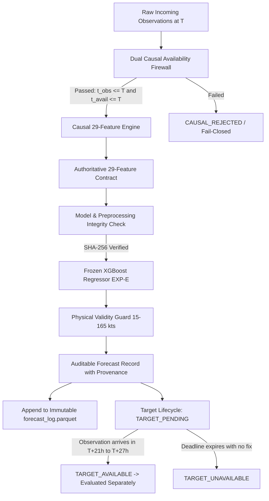

# Sagar-Drishti — Forward Prediction & Prospective Inference Mode
## System Architecture, Causal Data Provenance, and Operational Specification

### 1. Architectural Overview & Paradigm Shift

Sagar-Drishti was originally designed as a high-fidelity historical oceanographic and cyclone risk analytics platform. Under the **Forward Prediction / Prospective Inference Mode**, the system provides genuine prospective forward inference beyond the historical dataset cutoff ($T > \text{2026-06-23}$):

#### Historical Mode vs. Forward Prediction Mode:
- **Historical Mode (Phase 4.6)**: Evaluates pre-existing reanalysis grids (Copernicus 2024-07-23 to 2026-06-23) using the operational Random Forest multi-horizon risk models (101 features, lead times 0d to 3d).
- **Forward Prediction Mode (Research Prospective)**: Ingests newly arriving cyclone track fixes, atmospheric sounding/analyses, and ocean observations strictly available at forecast origin $T$ to predict $T+24\text{h}$ maximum sustained wind intensity ($V_{\text{max}}$) using the frozen XGBoost model (29 features).

---

### 2. Dual Causal Availability Firewall

A core scientific requirement of prospective inference is that **future information can never contaminate the forecast origin $T$**. The system enforces two independent temporal constraints:

1. **Observation Timestamp Firewall**:
   $$\forall \text{ observation } i: \quad t_{\text{obs}, i} \le T_{\text{origin}}$$
   Observations with $t_{\text{obs}} > T_{\text{origin}}$ are strictly rejected.
2. **Data Availability Timestamp Firewall**:
   $$\forall \text{ observation } i: \quad t_{\text{avail}, i} \le T_{\text{origin}}$$
   Observations that occurred prior to $T_{\text{origin}}$ but were not yet published or received until after $T_{\text{origin}}$ are rejected.
3. **Rejection of Filesystem Timestamps**:
   Filesystem `mtime` or `ctime` is explicitly banned. Valid metadata publication timestamps are strictly required.

---

### 3. Authoritative 29-Feature Contract

The frozen XGBoost model (`research/cyclone_intensity/models/final_intensity_model.joblib`) accepts exactly 29 features in invariant order:

| Index | Feature Name | Category | Raw Source | Spatial Domain | Temporal Window | Aggregation / Transformation |
| :---: | :--- | :--- | :--- | :--- | :--- | :--- |
| 0 | `vmax_current` | Kinematic | IMD / Synoptic Fix | Storm center | Fix $\le T$ | Identity (knots) |
| 1 | `dvmax_6h` | Kinematic | Track history | Storm center | $[T-6\text{h}, T]$ | $V_{\text{max}}(T) - V_{\text{max}}(T-6\text{h})$ |
| 2 | `dvmax_12h` | Kinematic | Track history | Storm center | $[T-12\text{h}, T]$ | $V_{\text{max}}(T) - V_{\text{max}}(T-12\text{h})$ |
| 3 | `dvmax_24h` | Kinematic | Track history | Storm center | $[T-24\text{h}, T]$ | $V_{\text{max}}(T) - V_{\text{max}}(T-24\text{h})$ |
| 4 | `pc_current` | Kinematic | Synoptic Fix | Storm center | Fix $\le T$ | Identity (hPa) |
| 5 | `dpc_6h` | Kinematic | Track history | Storm center | $[T-6\text{h}, T]$ | $P_c(T) - P_c(T-6\text{h})$ |
| 6 | `translation_speed_kts` | Kinematic | Track history | Storm vector | $[T_{\text{prev}}, T]$ | Haversine distance / $\Delta t$ (knots) |
| 7 | `latitude_current` | Geospatial | Track fix | Storm center | Fix $\le T$ | Decimal degrees North |
| 8 | `longitude_current` | Geospatial | Track fix | Storm center | Fix $\le T$ | Decimal degrees East |
| 9 | `vws_env_mean_200_800km` | Atmosphere | ERA5 / NWP Analysis | 200–800 km annulus | Time slice $\le T$ | Spatial mean magnitude (knots) |
| 10 | `vws_env_min_200_800km` | Atmosphere | ERA5 / NWP Analysis | 200–800 km annulus | Time slice $\le T$ | Spatial minimum magnitude (knots) |
| 11 | `vws_core_mean_0_100km` | Atmosphere | ERA5 / NWP Analysis | 0–100 km inner core | Time slice $\le T$ | Spatial mean magnitude (knots) |
| 12 | `vort_core_mean_0_100km` | Atmosphere | ERA5 / NWP Analysis | 0–100 km inner core | Time slice $\le T$ | Mean relative vorticity $vo \times 10^5$ |
| 13 | `vort_core_max_0_100km` | Atmosphere | ERA5 / NWP Analysis | 0–100 km inner core | Time slice $\le T$ | Max relative vorticity $vo \times 10^5$ |
| 14 | `vort_env_mean_200_800km` | Atmosphere | ERA5 / NWP Analysis | 200–800 km annulus | Time slice $\le T$ | Mean relative vorticity $vo \times 10^5$ |
| 15 | `rh_700_env_mean_200_800km` | Atmosphere | ERA5 / NWP Analysis | 200–800 km annulus | Time slice $\le T$ | Mean relative humidity at 700 hPa (%) |
| 16 | `rh_700_env_min_200_800km` | Atmosphere | ERA5 / NWP Analysis | 200–800 km annulus | Time slice $\le T$ | Min relative humidity at 700 hPa (%) |
| 17 | `rh_700_core_mean_0_100km` | Atmosphere | ERA5 / NWP Analysis | 0–100 km inner core | Time slice $\le T$ | Mean relative humidity at 700 hPa (%) |
| 18 | `rh_500_env_mean_200_800km` | Atmosphere | ERA5 / NWP Analysis | 200–800 km annulus | Time slice $\le T$ | Mean relative humidity at 500 hPa (%) |
| 19 | `rh_500_core_mean_0_100km` | Atmosphere | ERA5 / NWP Analysis | 0–100 km inner core | Time slice $\le T$ | Mean relative humidity at 500 hPa (%) |
| 20 | `sst_core_mean_0_100km` | Ocean | Copernicus Physics | 0–100 km inner core | Daily analysis $\le T$ | Mean surface temperature ($^\circ\text{C}$) |
| 21 | `sst_env_mean_200_800km` | Ocean | Copernicus Physics | 200–800 km annulus | Daily analysis $\le T$ | Mean surface temperature ($^\circ\text{C}$) |
| 22 | `mld_core_mean_0_100km` | Ocean | Copernicus Physics | 0–100 km inner core | Daily analysis $\le T$ | Mean mixed layer depth (m) |
| 23 | `sla_core_mean_0_100km` | Ocean | Copernicus Physics | 0–100 km inner core | Daily analysis $\le T$ | Mean sea level anomaly (m) |
| 24 | `delta_vws_core_minus_env` | Contrast | Derived | Contrast | Time slice $\le T$ | `vws_core_mean_0_100km - vws_env_mean_200_800km` |
| 25 | `delta_vort_core_minus_env` | Contrast | Derived | Contrast | Time slice $\le T$ | `vort_core_mean_0_100km - vort_env_mean_200_800km` |
| 26 | `delta_rh700_core_minus_env` | Contrast | Derived | Contrast | Time slice $\le T$ | `rh_700_core_mean_0_100km - rh_700_env_mean_200_800km` |
| 27 | `delta_rh500_core_minus_env` | Contrast | Derived | Contrast | Time slice $\le T$ | `rh_500_core_mean_0_100km - rh_500_env_mean_200_800km` |
| 28 | `delta_sst_core_minus_env` | Contrast | Derived | Contrast | Daily analysis $\le T$ | `sst_core_mean_0_100km - sst_env_mean_200_800km` |

---

### 4. Three Explicit Operating Modes

1. **`TRUE_PROSPECTIVE`**:
   - Live forward inference where observation timestamp and data availability timestamp correspond to actual incoming data feeds in real time.
   - Ground-truth target observations at $T+24\text{h}$ do not yet exist at inference time.
2. **`AVAILABILITY_TIMESTAMP_REPLAY`**:
   - Replay mode on historical or synthetic fixtures with simulated availability cutoffs.
   - Used to verify pipeline mechanics, latency, and causal firewalling.
   - **Crucial scientific rule**: Replay fixtures are never presented as proof of real-world forecast skill.
3. **`HISTORICAL_BACKTEST`**:
   - Classical retrospective benchmark evaluation.

---

### 5. Target Lifecycle State Machine

Once a prediction record is generated at origin $T$, it is logged immutably and enters the target lifecycle:

1. **`TARGET_PENDING`**:
   - Real-world clock or current observation time $< T + 21\text{h}$.
   - The forecast is live and waiting for ground truth verification.
2. **`TARGET_AVAILABLE`**:
   - A verified ground-truth track fix is recorded within the target window $[T+21\text{h}, T+27\text{h}]$.
   - Error metrics (Absolute Error, Squared Error) are computed separately in the prospective log.
   - The original forecast record remains 100% immutable.
3. **`TARGET_UNAVAILABLE`**:
   - The storm dissipates, moves overland, or ceases observation before reaching the target window.
   - **Crucial scientific rule**: `TARGET_UNAVAILABLE` records do **NOT** receive zero error ($\text{error} \ne 0$). They are strictly excluded from the MAE/RMSE denominator and reported separately under target coverage accounting.
4. **`TARGET_EXCLUDED`**:
   - The target observation exists but is disqualified from scientific prospective evaluation due to provenance failure (e.g. synthetic status), data corruption, or temporal violation ($T_{\text{forecast\_created\_at}} \ge T_{\text{target\_available\_at}}$).
5. **Target Revision Isolation**:
   - If an operational observation is later revised (e.g. IMD post-season best track), the revision is logged with `evaluation_type = RETROSPECTIVE_REVISED` without mutating the initial `PROSPECTIVE_INITIAL` record.

---

### 6. Synthetic Test Fixture Policy & Restriction

The pre-packaged demo scenarios (`DEMO-BOB-2026-07-10` and `DEMO-ARAS-2026-08-15`) are:
- **Type**: `SYNTHETIC_TEST_FIXTURE`
- **Mandatory UI Label**: `SYNTHETIC TEST FIXTURE — NOT REAL METEOROLOGICAL DATA`
- **Scientific Restriction**: Used exclusively to demonstrate pipeline execution, UI interactivity, and causal firewall behavior.
- **Accuracy Claim Ban**: Prospective MAE/RMSE or forecast accuracy must never be computed from synthetic test fixtures and claimed as prospective scientific skill.

---

### 7. Mandatory Scientific Disclaimer

Every user interface card, API JSON response, and conversational response carries the non-negotiable scientific notice:

> *"Forward inference uses the frozen research model on user-provided or newly available observations. This forecast is not itself proof of prospective generalization; future outcomes are evaluated separately through the prospective validation framework."*

---

### 8. Real-World Data Provenance & Operational Atmospheric Contracts

1. **Four Provenance Classes**:
   - `REAL_PROSPECTIVE`: Real observations collected before origin $T$ where forecast was logged before target availability. Only this class may contribute to prospective accuracy metrics.
   - `SYNTHETIC_TEST_FIXTURE`: Synthetic test observations. Excluded from prospective accuracy metrics.
   - `HISTORICAL_REANALYSIS`: Historical/reanalysis data (e.g. ERA5). Excluded from prospective accuracy metrics.
   - `UNKNOWN`: Unverified provenance. Excluded from prospective accuracy metrics.

2. **Atmospheric Source Contract**:
   - `OPERATIONAL_NWP_ANALYSIS`: Authorized operational NWP source for true real-time forward prediction.
   - `ERA5_REANALYSIS`: Multi-month latency. Automatically reclassified as `HISTORICAL_REANALYSIS` if supplied for a forward date.
   - `OTHER_VERIFIED_OPERATIONAL_SOURCE`: Verified operational sounding or satellite wind analysis.

---

### 9. Ocean Temporal Resolution & Freshness Policy

- **Daily Resolution Preserved**: Copernicus daily ocean analysis is never interpolated into synthetic 6-hourly values.
- **Freshness Policy**: Ocean age must be $\le 48\text{ hours}$. If older or unpublished at origin $T$, ocean features are set to `NaN` (missing) without synthetic imputation.
- **Ocean Provenance Tracking**: Tracks ocean timestamp, availability timestamp, ocean age in hours, and ocean temporal resolution (`daily`).

---

### 10. Canonical Historical Partition Boundaries

The authoritative research partition boundaries are immutable across all documentation and evaluation code:
- **TRAIN**: `2016–2021` (64 storms, 1,121 targets)
- **VALIDATION**: `2022–2023` (24 storms, 367 targets)
- **TEST**: `2024–2026` (29 storms, 552 targets, quarantined holdout)

---

### 11. Clustered Bootstrap & Prospective Evidence Tiers

- **Storm-Level Resampling**: Bootstrap resampling is grouped by storm ($B = 1,000$, 95% CI) rather than individual 6-hourly fixes to prevent autocorrelation bias.
- **Prospective Evidence Tiers**:
  - $< 5$ genuine storms: `INSUFFICIENT_PROSPECTIVE_EVIDENCE` (bootstrap classified as unstable)
  - $5–14$ genuine storms: `EARLY_PROSPECTIVE_SIGNAL`
  - $15–29$ genuine storms: `PROMISING_PROSPECTIVE_EVIDENCE`
  - $\ge 30$ genuine storms: `ADEQUATE_PROSPECTIVE_SAMPLE_FOR_PRELIMINARY_GENERALIZATION`
  - *Evidence Target Note*: 30 independent genuine prospective storms is the project's predefined evidence target for assessing whether a meaningful prospective skill analysis is possible, not a universal statistical requirement.
- **Current Evidence**: `GENUINE_PROSPECTIVE_STORMS = 0`, `PROSPECTIVE_SCIENTIFIC_EVIDENCE = NONE`.

